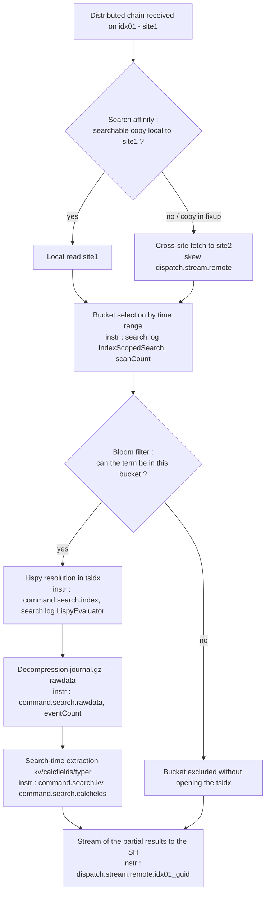

# Chapter 04 — Map on the indexers (heart of the time)

> 🇫🇷 **Version française disponible** : [`../04-map-sur-indexeurs.md`](../04-map-sur-indexeurs.md)

> **Time stake** — The **map** phase is, on a distributed platform, the one
> that most often concentrates the majority of the wallclock: it is there that each
> search peer opens buckets, resolves the *lispy* in the tsidx, decompresses the
> `journal.gz` and applies the search-time extraction before streaming its
> partial results. The symptom reads at a glance in the Job Inspector: a
> dominant `command.search.rawdata` or `command.search.index` in the
> *Execution costs*, a `scanCount` much higher than the `eventCount`, or a
> `dispatch.stream.remote.<peer_guid>` imbalanced between sites. After this
> chapter, you can say whether this time comes from a too-broad time range, from
> non-selective terms, from a heavy search-time extraction or from a defect of
> multisite **search affinity** — and act on the corresponding lever, while
> distinguishing what you set on your own from what belongs to the cluster admin.

## Mechanical recap

The map phase runs on each **search peer** (indexer — `idx01`, `idx02`,
`idx03`), in parallel. On receiving the distributed chain, the peer unrolls
four sub-steps: (1) **bucket selection** whose time bounds
overlap the time range; (2) **exclusion by bloom filters** — a Bloom filter
per bucket allows excluding a bucket that surely does not contain a searched
term *without opening its tsidx* (see
[Splexicon — bloom filter](https://docs.splunk.com/Splexicon:Bloomfilter));
(3) **tsidx resolution** — the *lispy* expression maps the keywords to the
postings in the bucket's `.tsidx` files (see
[Splexicon — tsidx file](https://docs.splunk.com/Splexicon:Tsidxfile));
(4) **rawdata materialization** — for the retained events, reading and
decompression of the `journal.gz`, then search-time extraction of the fields. The
partial results then rise to the search head.

In multisite, each bucket exists in several copies distributed per site according to
`site_replication_factor`/`site_search_factor`; a *searchable* copy carries the
tsidx. The **search affinity** makes a SH query preferentially the copies of
its own site (see
[Splexicon — search affinity](https://docs.splunk.com/Splexicon:Searchaffinity)),
avoiding a cross-site fetch. The governance: `indexes.conf` (bucket structure)
and `server.conf [clustering]` of the cluster manager `cm01` (site factors). The
instruments: *Execution costs* (`command.search.*`), *Search job properties*
(`scanCount`/`eventCount`), `search.log` (`LispyEvaluator`, `IndexScopedSearch`)
and `remote_searches.log` on each peer.

## Time decomposition of this phase

The time is spent *inside* the map in the order of the sub-steps, each
exposed by a precise marker. The diagram follows a search arriving on a peer,
with the multisite search affinity decision upstream of the bucket opening.



Three cardinal readings. First, `scanCount` >> `eventCount` signals that you
**open events (and often buckets) only to throw them away afterward**: too many
buckets (broad time range) or non-selective terms. Next, the split
between `command.search.index` (tsidx cost) and `command.search.rawdata` (decompression
cost) tells *which* sub-step dominates: a high `index` points to a costly
*lispy* resolution or many buckets opened; a high `rawdata`
points to a massive materialization of the `journal.gz`. Finally, a
`dispatch.stream.remote.<peer_guid>` systematically higher for the peers
of one site than of another betrays an **inter-site skew** — often a defect
of affinity that forces the cross-site fetch (see
[Use the Job Inspector](https://docs.splunk.com/Documentation/Splunk/9.4/Search/ViewsearchjobpropertieswiththeJobInspector)).

## Action levers

- **Lever — tighten the time range.** Set an explicit interval (time
  picker or `earliest`/`latest`), never *All time* by reflex.
  - **Expected time effect** — the time range conditions the number of buckets
    eligible for map: the time bounds of each bucket decide its
    eligibility, and fewer buckets opened translates into fewer events read,
    hence shorter `command.search.index` and `command.search.rawdata`.
    This is the highest-impact lever on this phase (see
    [How to optimize searches](https://docs.splunk.com/Documentation/Splunk/9.4/Search/Optimizesearches)).
  - **How to measure it** — `scanCount` (Search job properties) before/after;
    number of buckets scanned in the `IndexScopedSearch` line of `search.log`.
  - **Boundary** — *self-contained*.

- **Lever — maximize the selectivity of the indexed terms.** Place the rare
  terms first, avoid leading wildcards (`*foo`) and negations
  (`NOT`/`!=`) as a primary filter, rely on the *major breakers* of the
  segment.
  - **Expected time effect** — a selective term lets the **bloom filters**
    exclude more buckets without opening their tsidx, and the *lispy*
    resolve fewer postings; conversely, a leading wildcard or a negation
    eliminate no bucket and neutralize tsidx and bloom, forcing a broad scan
    (see [Splexicon — bloom filter](https://docs.splunk.com/Splexicon:Bloomfilter)
    and [How to optimize searches](https://docs.splunk.com/Documentation/Splunk/9.4/Search/Optimizesearches)).
  - **How to measure it** — `command.search.index` in the *Execution costs*;
    the gap `scanCount` vs `eventCount` (a `scanCount` >> `eventCount` reveals
    buckets opened for nothing); the expression evaluated in the
    `LispyEvaluator` line of `search.log`.
  - **Boundary** — *self-contained*.

- **Lever — switch to `tstats` when only indexed fields are required.**
  Rewrite a search that only needs `index`, `sourcetype`, `host`,
  `_time` or indexed extractions as `| tstats … where …`.
  - **Expected time effect** — `tstats` works on the tsidx alone and
    **avoids the rawdata decompression**; in 9.x, this removes the bulk of the
    `command.search.rawdata` cost for the eligible aggregations (see
    [tstats](https://docs.splunk.com/Documentation/Splunk/9.4/SearchReference/Tstats)).
  - **How to measure it** — drop in `command.search.rawdata` between the
    `stats` variant and the `tstats` variant in the *Execution costs*; `eventCount`
    become moot when the counting is done on the postings.
  - **Boundary** — *D3 cross-reference* — the acceleration mechanics and the coverage
    conditions are treated in
    [`06-acceleration-comme-levier.md`](06-acceleration-comme-levier.md); the
    lever retained here: everything that resolves in the tsidx does not open the
    `journal.gz`.

- **Lever — reduce the rawdata materialization.** Filter and project early:
  push the predicates up into the base search and set a restrictive `fields` before
  any command that needs the whole events.
  - **Expected time effect** — fewer events cross the decompression and
    the extraction, and fewer fields are carried: the `command.search.rawdata` cost
    decreases with the number of events actually materialized (see
    [How search works](https://docs.splunk.com/Documentation/Splunk/9.4/Capacity/Howsearchworks)).
  - **How to measure it** — `command.search.rawdata` and `eventCount` before/after;
    an `eventCount` that drops at constant `resultCount` confirms that you
    materialize less for the same result.
  - **Boundary** — *self-contained*.

- **Lever — guarantee the multisite search affinity.** Maintain
  `site_search_factor` ≥ 1 for each site in `server.conf [clustering]` of the
  cluster manager `cm01`, so that a SH always has a searchable copy
  local to its site.
  - **Expected time effect** — with a local searchable copy, the SH reads on
    the peers of its own site instead of crossing the inter-site; the
    affinity removes the cross-site fetch and its latency skew (see
    [Multisite search affinity](https://docs.splunk.com/Documentation/Splunk/9.4/Indexer/Multisitesearchaffinity)
    and [Splexicon — search factor](https://docs.splunk.com/Splexicon:Searchfactor)).
  - **How to measure it** — skew of `dispatch.stream.remote.<peer_guid>` per
    site (the peers of one site systematically slower); `remote_searches.log`
    on the peers to see *which* site responds; disappearance of the skew after
    correction of the site factor.
  - **Boundary** — *admin-only* (cluster manager) — ask: "bring
    `site_search_factor` to a value guaranteeing a searchable copy per site
    and launch the fixup".

- **Lever — lighten the costly search-time extraction.** Identify the
  heavy search-time `KV_MODE`, `EXTRACT-*`, `TRANSFORMS-*` on a hot sourcetype
  and promote the truly hot fields to index-time extraction
  (`props.conf`/`fields.conf`).
  - **Expected time effect** — a search-time field is recomputed on the peer on
    *every* search; promoted to index-time, it is already materialized (hence free
    at map) and becomes eligible for `tstats`, which reduces `command.search.kv`
    and `command.search.calcfields` (see
    [How search works](https://docs.splunk.com/Documentation/Splunk/9.4/Capacity/Howsearchworks)).
  - **How to measure it** — `command.search.kv`, `command.search.calcfields`,
    `command.search.fieldalias` in the *Execution costs* before/after promotion.
  - **Boundary** — *admin-only* (parsing / index-time, on the indexing
    layer) — ask: "promote field X of sourcetype Y to
    index-time extraction". Which parameters run at which phase:
    [`../../../concepts/splunk-parsing-phase-uf-vs-hf.md`](../../../concepts/splunk-parsing-phase-uf-vs-hf.md).

- **Lever — avoid heavy searches during a rebalance or a non-searchable
  fixup.** Schedule the rebalances outside the critical search
  windows and require `splunk rebalance cluster-data -searchable true`.
  - **Expected time effect** — without `-searchable true`, buckets can
    become transiently non-searchable; the map then falls back on a distant copy
    or waits for the fixup, which swells the time per peer. Rebalancing in
    searchable mode moves the copies one by one with prior promotion of a
    primary, preserving searchability (see
    [Rebalance the indexer cluster](https://docs.splunk.com/Documentation/Splunk/9.4/Indexer/Rebalancethecluster)).
  - **How to measure it** — state of the buckets and the peers via
    `| rest /services/cluster/manager/buckets` and `.../peers`; temporal
    correlation between the map slowdown and an ongoing fixup/rebalance.
  - **Boundary** — *D3 cross-reference* + *admin-only* (cluster manager) — the fixup
    cycle is described in
    [`../../../concepts/splunk-buckets-multisite-lifecycle.md`](../../../concepts/splunk-buckets-multisite-lifecycle.md)
    and the rebalance modes in
    [`../../../concepts/splunk-rebalance-multisite.md`](../../../concepts/splunk-rebalance-multisite.md);
    the lever retained here: rebalancing with `-searchable true` avoids a bucket
    becoming transiently non-searchable and making the map switch to cross-site.

- **Lever — exploit the batch mode and the per-bucket parallelization.** Ensure
  that the peers are sized to parallelize the processing of the buckets
  (data parallelization) and that the suited execution mode is retained for the
  long non-progressive searches.
  - **Expected time effect** — a correctly sized peer processes
    more buckets in parallel per search, which shortens the map at
    equal volume; the indexer sizing (CPU, I/O) conditions this
    parallelism (see
    [Reference hardware](https://docs.splunk.com/Documentation/Splunk/9.4/Capacity/Referencehardware)
    and [How search works](https://docs.splunk.com/Documentation/Splunk/9.4/Capacity/Howsearchworks)).
  - **How to measure it** — search concurrency per peer via
    `metrics.log group=search_concurrency`; comparison of the time per peer in
    `dispatch.stream.remote.<peer_guid>` at comparable load.
  - **Boundary** — *admin-only* (indexer sizing / Capacity Planning) —
    ask: "review the peer sizing for the search parallelism
    on index Z".

## Costly anti-patterns

- **Leaving the time picker on *All time* by reflex.** All the buckets of
  the index become eligible for map, regardless of the age of the data. Marker:
  `scanCount` very high relative to `eventCount`. Fix: bound the time
  range.
- **Filtering with a leading wildcard (`*error`) or with a negation (`NOT`/`!=`) as a
  primary filter.** These forms eliminate no bucket: tsidx and bloom filters
  are inoperative, the peer opens everything and throws away afterward. Marker:
  high `command.search.index`, `scanCount` >> `eventCount`. Fix: a
  selective positive term first, the negation as a secondary filter.
- **Loading the search-time extraction in the base search on a hot
  sourcetype.** Every materialized event pays the extraction, on every search.
  Marker: dominant `command.search.kv`/`command.search.calcfields`. Fix:
  lighten the automatic KOs and promote the hot fields to index-time.
- **Tolerating an insufficient `site_search_factor`.** For lack of a local
  searchable copy, the SH reads cross-site on every search; the peers of another site are
  over-solicited. Marker: skew of `dispatch.stream.remote.<peer_guid>` per
  site. Fix: restore the site factor (CM admin).
- **Launching heavy searches during a non-searchable rebalance.** Transient
  non-searchable buckets make the map wait or deviate. Marker:
  slowdown correlated with a fixup/rebalance in the cluster state. Fix:
  rebalance with `-searchable true`, outside the critical window.
- **Confusing `scanCount` and `eventCount` to judge a filter.** Believing the filter
  effective while `scanCount` >> `eventCount` betrays late filtering at map.
  Marker: the gap between the two properties. Fix: push the predicate up
  and improve the indexed selectivity.

## Worked examples

### A time dominated by rawdata decompression

Search on a bulky web sourcetype, over 7 days, slow.

```spl
index=main sourcetype=access_combined earliest=-7d@d latest=now
| stats count by status
```

What you read in the Job Inspector: in the *Execution costs*,
`command.search.rawdata` dominates (each event is decompressed from the
`journal.gz`), `command.search.index` stays modest, and `scanCount` is much
higher than `eventCount`. The count bears only on `status`: no non-indexed field
requires opening the events. Corrected version if `status` is an indexed field
or covered by an accelerated data model:

```spl
| tstats count where index=main sourcetype=access_combined by status
    earliest=-7d@d latest=now
```

After the switch, `command.search.rawdata` collapses: the answer reads in the
tsidx without materializing the rawdata (cross-reference ch06 for the required coverage).

### A non-selective term that neutralizes the bloom filters

Search looking for an error substring with a leading wildcard.

```spl
index=os sourcetype=linux_secure "*failed*" earliest=-24h@h latest=now
| stats count by host
```

What you read in the Job Inspector: `command.search.index` is high and `scanCount`
close to the total volume of the index over the window — the leading wildcard prevents the
bloom filters from excluding a single bucket and the *lispy* from targeting postings
(`LispyEvaluator` line of `search.log` with no discriminating term). Corrected version
with an anchored positive term:

```spl
index=os sourcetype=linux_secure "Failed password" earliest=-24h@h latest=now
| stats count by host
```

The selective term lets the bloom filters exclude the buckets with no occurrence:
`scanCount` drops toward the order of magnitude of `eventCount`.

### An inter-site skew revealing an affinity defect

Multisite search whose time per peer is imbalanced.

What you read in the Job Inspector: `dispatch.stream.remote.<idx02_guid>` (site2) is
several times higher than `dispatch.stream.remote.<idx01_guid>` (site1), while
both sites carry a comparable volume. Reading `remote_searches.log`
on the peers:

```text
2026-07-26 10:15:02.451 remote_search sid=00000000-0000-0000-0000-000000000001 host=idx02 elapsed_ms=8420
```

One site responds slowly systematically, not occasionally: it is not an
isolated peer but a whole site. The probable cause is a **search
affinity defect** — for lack of a searchable copy local to the SH's site, the map falls
back on the peers of the other site (cross-site fetch). The lever is admin-only: restore
`site_search_factor` ≥ 1 per site on `cm01` and let the fixup rebuild the local
searchable copies. To be distinguished from a *single* slow peer (a single
high `dispatch.stream.remote`), which would point to a hardware problem or a localized
fixup, not the affinity.

## Conditional cross-references (D3)

- **Life cycle and fixup of the multisite buckets** —
  [`../../../concepts/splunk-buckets-multisite-lifecycle.md`](../../../concepts/splunk-buckets-multisite-lifecycle.md).
  The freeze/fixup cycle is described there in full; the fact retained here: a bucket
  whose searchable copy is in fixup can make the map switch to a distant copy
  or make it wait.
- **Multisite rebalance (`-searchable true`, data vs primary rebalance)** —
  [`../../../concepts/splunk-rebalance-multisite.md`](../../../concepts/splunk-rebalance-multisite.md).
  The two operations are distinguished there in full; the lever retained here:
  rebalancing with `-searchable true` avoids a bucket becoming transiently
  non-searchable and making the map deviate to cross-site.
- **Index-time vs search-time — which field is promotable** —
  [`../../../concepts/splunk-parsing-phase-uf-vs-hf.md`](../../../concepts/splunk-parsing-phase-uf-vs-hf.md).
  The distribution of the `props.conf` parameters between phases is treated there; the fact
  retained here: a field materialized at index-time is free at map and eligible
  for `tstats`, a search-time field is recomputed on every search.
- **ITSI + Federated Search case** —
  [`../../../concepts/splunk-itsi-federated-search.md`](../../../concepts/splunk-itsi-federated-search.md).
  The federated model is described there in full; the fact retained here: in
  transparent mode, the restriction applies on the provider side and the temporal map
  runs on the indexers of the distant provider, not on the initiating SH.
- **Acceleration (`tstats`, data model acceleration)** —
  [`06-acceleration-comme-levier.md`](06-acceleration-comme-levier.md). The
  time cost/benefit of the acceleration is treated there; the lever retained here:
  what resolves in the tsidx does not open the `journal.gz` and removes
  the bulk of the `command.search.rawdata`.

## Sources

- [Splunk Search Manual 9.4 — How to optimize searches](https://docs.splunk.com/Documentation/Splunk/9.4/Search/Optimizesearches)
- [Splunk Search Manual 9.4 — Use the Job Inspector](https://docs.splunk.com/Documentation/Splunk/9.4/Search/ViewsearchjobpropertieswiththeJobInspector)
- [Splunk Managing Indexers and Clusters of Indexers 9.4 — Multisite search affinity](https://docs.splunk.com/Documentation/Splunk/9.4/Indexer/Multisitesearchaffinity)
- [Splunk Managing Indexers and Clusters of Indexers 9.4 — How the indexer stores indexes (buckets)](https://docs.splunk.com/Documentation/Splunk/9.4/Indexer/Howtheindexerstoresindexes)
- [Splunk Managing Indexers and Clusters of Indexers 9.4 — Rebalance the indexer cluster](https://docs.splunk.com/Documentation/Splunk/9.4/Indexer/Rebalancethecluster)
- [Splunk Capacity Planning Manual 9.4 — How search works](https://docs.splunk.com/Documentation/Splunk/9.4/Capacity/Howsearchworks)
- [Splunk Capacity Planning Manual 9.4 — Reference hardware](https://docs.splunk.com/Documentation/Splunk/9.4/Capacity/Referencehardware)
- [Splunk Search Reference 9.4 — tstats](https://docs.splunk.com/Documentation/Splunk/9.4/SearchReference/Tstats)
- [Splexicon — bucket](https://docs.splunk.com/Splexicon:Bucket)
- [Splexicon — tsidx file](https://docs.splunk.com/Splexicon:Tsidxfile)
- [Splexicon — bloom filter](https://docs.splunk.com/Splexicon:Bloomfilter)
- [Splexicon — search affinity](https://docs.splunk.com/Splexicon:Searchaffinity)
- [Splexicon — search factor](https://docs.splunk.com/Splexicon:Searchfactor)
