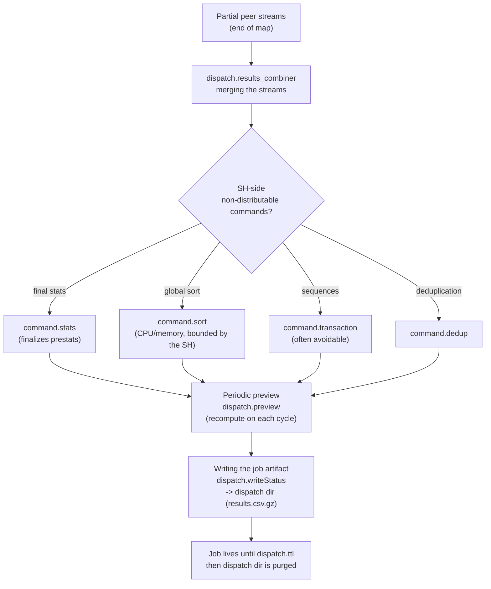

# Chapter 05 — Reduce on the search head and job rendering

> 🇫🇷 **Version française disponible** : [`../05-reduce-et-restitution.md`](../05-reduce-et-restitution.md)

> **Time stake** — When the map is finished on the peers but the result
> counter stalls, the time is being spent on the search head, in the
> *reduce* phase: the non-distributable commands (final `stats`, `sort`,
> `transaction`, `dedup`) consume the peer streams, the periodic preview
> recomputes, and the job artifact is written to the dispatch dir. This phase is
> bounded by the CPU and memory of a single node — the SH — where the map was
> parallelized across N indexers. A dominant `command.sort` or `command.transaction`
> in the *Execution costs*, or a repeated `dispatch.preview`, gives it away.
> After this chapter, you can read these items, decide what can go back down to
> the distributed phase (`prestats`), and bound what remains.

## Mechanical recap

The reduce runs **on the search head** (`sh01`, or the captain `captain01` for
a clustered scheduled search). The SH consumes the streams returned by the peers
on the fly and applies the **non-streaming** commands: final `stats`, global
`sort`, `dedup`, `head`, `transaction`. A streaming command (`eval`, `where`,
`rex`, `fields`) runs in parallel on the peers; a transforming command breaks
this parallelization and brings the work back to the SH.

`stats` is a mixed case: it decomposes into a **`prestats`** pre-aggregation
pushed to the peers and a finalization on the SH — the distributed part appears
as `command.prestats` (peer-side), the finalization as `command.stats` (SH-side).
`sort`, `dedup` and `transaction`, on the other hand, are entirely centralized.

During execution, the SH generates a **preview** at regular intervals (it
recomputes the current partial result) and writes progressively into the
**dispatch dir** (`$SPLUNK_HOME/var/run/splunk/dispatch/<sid>/`, `results.csv.gz`
and event files). The job persists until its `ttl` expires
(`dispatch.ttl`), then the dispatch dir is purged. Pagination then serves
slices of the materialized result. The end-to-end sequence (verification →
fan-out → map → reduce) is described in chapter 00; this chapter isolates the
last step and its levers (see
[Search Manual — About jobs and job management](https://docs.splunk.com/Documentation/Splunk/9.4/Search/Aboutjobsandjobmanagement)).

## Time decomposition of this phase

The reduce reads in two areas of the Job Inspector: the SH-side *Execution costs*
(`command.stats`, `command.sort`, `command.transaction`, `command.dedup`)
and the `dispatch.*` orchestration items (`dispatch.results_combiner`,
`dispatch.preview`, `dispatch.writeStatus`). The `resultCount` property (final
rows produced) and the size of the dispatch dir complete the picture.



The reading rule: the more work the pipeline pushes into `command.prestats`
(peer-side), the less remains for `command.stats`/`command.sort` (SH-side). A
dominant `command.sort` or `command.transaction`, with a high `resultCount`,
signals a heavy reduce. A repeated and costly `dispatch.preview` signals a
preview too frequent for the volume processed.

`dispatch.results_combiner` isolates the cost of **merging** the partial streams:
it rises when many peers return many rows to stitch together, even without a
costly centralized command downstream. `dispatch.writeStatus` times the writing
of the status and the job artifact; it drags when `resultCount` is massive or
when the dispatch dir is already under pressure (see the TTL lever).
Finally, UI **pagination** does not restart the reduce: it serves slices of the
already-materialized `results.csv.gz` — the slowness perceived when scrolling
through a large job comes from the size of the result, not from a recomputation.
These three facts separate a *computational* reduce (SH-side commands) from a
*volumetric* reduce (too many rows to combine, write and paginate).

## Action levers

- **Lever — push the work into the distributed phase (`prestats`).** Rewrite
  an SH-only command into a decomposable form: `stats count by <key>`
  pre-aggregates as `prestats` on the peers, only the merge comes back to the SH;
  prefer a distributable `stats` over a centralized `transaction` or `eventstats`.
  - **Expected time effect** — in 9.x, the part pre-aggregated on the peers
    is no longer paid on the SH; the reduce is reduced to combining partial
    aggregates instead of processing each event (see
    [Search Manual — About jobs and job management](https://docs.splunk.com/Documentation/Splunk/9.4/Search/Aboutjobsandjobmanagement)).
  - **How to measure it** — the shift in the *Execution costs*: `command.prestats`
    (peers) rises, `command.stats` (SH) drops; also track the
    `dispatch.stream.remote` share vs the SH-side weight.
  - **Boundary** — *self-contained*.

- **Lever — avoid costly centralized commands (`sort`/`transaction`/`dedup`).**
  Ban an unbounded global `sort`, replace an avoidable `transaction` with
  `stats earliest()/latest() by <key>`, avoid a massive `dedup` when a
  `stats by` is enough.
  - **Expected time effect** — these three commands are entirely SH-side and
    bounded by the CPU/memory of a single node; eliminating or distributing them
    removes a `command.sort`/`command.transaction`/`command.dedup` item from the
    reduce (see [Search Reference — transaction](https://docs.splunk.com/Documentation/Splunk/9.4/SearchReference/Transaction)).
  - **How to measure it** — `command.sort`, `command.transaction`, `command.dedup`
    in the *Execution costs* before/after rewriting.
  - **Boundary** — *self-contained*; the `transaction` → `stats` rewriting
    discipline is a *D3 cross-reference* to the power-user handbook.

- **Lever — bound the results early (`head`, `maxResultRows`).** Place a
  `| head N` as soon as only a sample is useful, and know the `maxResultRows`
  ceiling (`limits.conf [searchresults]`) that bounds what a job
  materializes.
  - **Expected time effect** — fewer rows to sort, combine and
    write; a `sort` followed by a `head N` lets the optimizer keep only
    the top-N instead of sorting the whole set (see
    [Search Reference — head](https://docs.splunk.com/Documentation/Splunk/9.4/SearchReference/Head)).
  - **How to measure it** — `resultCount`, `dispatch.writeStatus` and the size
    of the dispatch dir drop together.
  - **Boundary** — *self-contained* for `head`; *admin-only* to raise/lower
    `maxResultRows` in `limits.conf`.

- **Lever — space out or disable the preview.** For a heavy search,
  turn off the preview (`preview=false` on a dashboard panel) or space out its
  interval (`preview` / `max_preview_period` in `limits.conf [search]`,
  or `dispatch.*` in `savedsearches.conf`).
  - **Expected time effect** — each preview cycle **recomputes** the
    current partial result; on a heavy transforming search, these
    recomputations add up to the useful time (see
    [Admin Manual — limits.conf](https://docs.splunk.com/Documentation/Splunk/9.4/Admin/Limitsconf)).
  - **How to measure it** — `dispatch.preview` in the *Execution costs*:
    number of invocations and cumulative duration.
  - **Boundary** — *self-contained* for `preview=false` on a dashboard;
    *admin-only* for the `limits.conf` defaults.

- **Lever — tune the job artifact TTL (`dispatch.ttl`).** Set a reasonable
  `ttl` (`dispatch.ttl` in `savedsearches.conf`, or the default in
  `limits.conf [search]`) so that finished jobs free the dispatch dir.
  - **Expected time effect** — this is not the time of *one* search but the
    disk pressure and the contention of the dispatch dir that spill back onto
    **all** searches: a saturated dispatch dir slows writing and
    cleanup (see
    [Search Manual — Dispatch directory and search artifacts](https://docs.splunk.com/Documentation/Splunk/9.4/Search/Dispatchdirectoryandsearchartifacts)).
  - **How to measure it** — number and volume of jobs under
    `$SPLUNK_HOME/var/run/splunk/dispatch/`; correlation with write
    latency (`dispatch.writeStatus`).
  - **Boundary** — *admin-only* for the `limits.conf` default; *self-contained*
    for `dispatch.ttl` on a saved search the reader owns.

- **Lever — prefer batch mode over real-time preview.** When
  completeness matters more than progressiveness (report, export, alert), run in
  batch: no preview, the result is rendered only at the end.
  - **Expected time effect** — by removing the preview recomputations, the SH
    only pays the single finalization; useful for a scheduled search
    whose progress nobody watches (see
    [Admin Manual — savedsearches.conf](https://docs.splunk.com/Documentation/Splunk/9.4/Admin/Savedsearchesconf)).
  - **How to measure it** — `dispatch.preview` close to zero in batch;
    `elapsedTime` vs the sum of the reduce items.
  - **Boundary** — *self-contained*.

## Costly anti-patterns

- **`sort` without `head`.** A global sort over millions of rows is paid
  entirely on the SH. Marker: high `command.sort`, massive `resultCount`.
  Fix: bound with `| head N`, or let the `stats` aggregation reduce
  the volume before sorting.
- **`transaction` where `stats` is enough.** `transaction <key>` to group
  events into sessions is almost always rewritable as
  `stats earliest()/latest() by <key>` — often 10× faster and distributable.
  Marker: dominant `command.transaction`. Fix: rewrite as `stats`
  (D3 cross-reference to power-user).
- **Unbounded `stats values(*)` / `list(*)`.** The per-row deduplicated
  list explodes SH memory on a high-cardinality field. Marker: reduce
  that swells in memory, large artifact. Fix: restrict to the useful fields
  (`values(user)`) or bound upstream (`head`, `dedup`).
- **30 s preview on a heavy search.** Each cycle recomputes; on a costly
  transforming, the preview sometimes doubles the work. Marker:
  `dispatch.preview` with many invocations. Fix: space out or turn off
  the preview, or switch to batch.
- **Huge TTL on frequent jobs.** An oversized `dispatch.ttl` multiplied by
  a volume of scheduled searches saturates the dispatch dir. Marker: large
  dispatch dir, `dispatch.writeStatus` dragging. Fix: adjust the `ttl`
  to the actual usage duration of the result.

## Worked examples

### A global `sort` that dominates the reduce

Search meant to surface the 20 most active IPs, but slow once the map is
finished.

```spl
index=main sourcetype=access_combined earliest=-24h@h latest=now
| stats count by clientip
| sort - count
```

What you read in the Job Inspector: `command.stats` is reasonable (the
`command.prestats` pre-aggregation ran well on the peers), but `command.sort`
dominates the *Execution costs* and `resultCount` is very high — the SH sorts
all the distinct IPs only to display the top of them. Fix: bound the sort.

```spl
index=main sourcetype=access_combined earliest=-24h@h latest=now
| stats count by clientip
| sort - count
| head 20
```

After: `command.sort` drops (the optimizer keeps only the top-20),
`resultCount` falls to 20, `dispatch.writeStatus` and the size of the dispatch
dir follow.

### An avoidable `transaction`

Search grouping a user's events into sessions.

```spl
index=security sourcetype=linux_secure earliest=-24h@h latest=now
| transaction user maxpause=30m
| stats count
```

What you read in the Job Inspector: `command.transaction` concentrates the time
of the reduce (the SH walks the stream event by event to build the groups), with
a risk of silent `maxevents` truncation. Rewritten as a distributable `stats`:

```spl
index=security sourcetype=linux_secure earliest=-24h@h latest=now
| stats earliest(_time) as debut latest(_time) as fin count by user
```

After: `command.transaction` disappears, replaced by a `command.stats`
aggregation largely pre-computed as `command.prestats` on the peers.

### A preview that recomputes

Dashboard panel wired to a heavy transforming search, with preview
active by default. What you read in the Job Inspector: `dispatch.preview`
accumulates a large number of invocations and a non-negligible duration, while
the final result no longer changes. Fix: `preview=false` on the panel (or batch
mode for a scheduled), and `dispatch.preview` falls back toward zero.

## Conditional cross-references (D3)

- **Distributed sequence and reduce phase (captain case)** —
  [`../../splunk-shc-knowledge-bundle/EN/04-distributed-search-sequence.md`](../../splunk-shc-knowledge-bundle/EN/04-distributed-search-sequence.md).
  The reduce is described there as step 4 of the sequence, notably the case where it
  runs on the captain of an SHC. The lever retained here: what is
  decomposable as `prestats` on the peers no longer weighs on the SH, visible in
  the `command.stats` → `command.prestats` / `dispatch.stream.remote` shift.
- **`stats` mindset and `transaction` → `stats` rewriting** —
  [`../../splunk-user-handbook/02-spl-transforming-and-stats.md`](../../splunk-user-handbook/02-spl-transforming-and-stats.md).
  The SPL discipline (when `stats` beats `transaction`/`eventstats`, how to bound
  `streamstats`, why `values(*)` is a memory risk) is fully taught there. The
  lever retained here: any centralized command rewritten into a
  distributable or bounded form lightens an SH-side `command.*` item of the reduce.

## Sources

- [Splunk Search Manual 9.4 — About jobs and job management](https://docs.splunk.com/Documentation/Splunk/9.4/Search/Aboutjobsandjobmanagement)
- [Splunk Search Manual 9.4 — Use the Job Inspector](https://docs.splunk.com/Documentation/Splunk/9.4/Search/ViewsearchjobpropertieswiththeJobInspector)
- [Splunk Search Manual 9.4 — Dispatch directory and search artifacts](https://docs.splunk.com/Documentation/Splunk/9.4/Search/Dispatchdirectoryandsearchartifacts)
- [Splunk Admin Manual 9.4 — limits.conf](https://docs.splunk.com/Documentation/Splunk/9.4/Admin/Limitsconf)
- [Splunk Admin Manual 9.4 — savedsearches.conf](https://docs.splunk.com/Documentation/Splunk/9.4/Admin/Savedsearchesconf)
- [Splunk Search Reference 9.4 — stats](https://docs.splunk.com/Documentation/Splunk/9.4/SearchReference/Stats)
- [Splunk Search Reference 9.4 — sort](https://docs.splunk.com/Documentation/Splunk/9.4/SearchReference/Sort)
- [Splunk Search Reference 9.4 — transaction](https://docs.splunk.com/Documentation/Splunk/9.4/SearchReference/Transaction)
- [Splunk Search Reference 9.4 — dedup](https://docs.splunk.com/Documentation/Splunk/9.4/SearchReference/Dedup)
- [Splunk Search Reference 9.4 — head](https://docs.splunk.com/Documentation/Splunk/9.4/SearchReference/Head)
