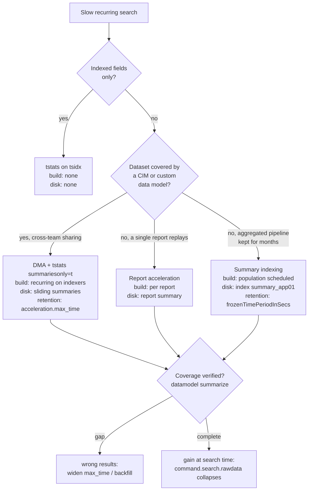

# Chapter 06 — Acceleration as a lever (time cost/benefit and sizing)

> 🇫🇷 **Version française disponible** : [`../06-acceleration-comme-levier.md`](../06-acceleration-comme-levier.md)

> **Time stake** — Acceleration does not make a search "faster"
> by magic: it **shifts the time**. A `tstats summariesonly=t` that answers in
> a fraction of a second has already paid its time elsewhere — in a recurring
> summary build on the indexers, disk tied up, retention to govern. This
> chapter treats acceleration from the angle of **sizing and time
> cost/benefit**: what gain at search time (`command.search.rawdata` collapsing),
> at what build cost (the build visible in `index=_internal`), over what
> coverage (`| datamodel <dm> summarize`), and where the admin-only boundary of
> activation runs. The **SPL mechanics** of the four strategies — how you write a
> `tstats`, what `summariesonly=t` does — is fully covered on the power-user side
> and is only recalled here to anchor the cost reasoning.

## Mechanical recap

The SPL mechanics of `tstats`, of data model acceleration (DMA), of report
acceleration and of summary indexing are **fully taught** in
[`../../splunk-user-handbook/04-spl-acceleration-tstats-datamodels.md`](../../splunk-user-handbook/04-spl-acceleration-tstats-datamodels.md);
here we take only the **time fact** useful for sizing.

Four strategies, one same trade: **search time** against **disk
+ build load + retention to manage**.

- **`tstats` on indexed fields** — reads the `tsidx` directly, without materializing
  the events. No build cost: the tsidx already exists. Free to build,
  limited to indexed fields (see [Search Reference — tstats](https://docs.splunk.com/Documentation/Splunk/9.4/SearchReference/Tstats)).
- **Data model acceleration (DMA)** — materializes tsidx-compatible summaries per
  bucket, over a sliding window; `tstats summariesonly=t … FROM datamodel=<dm>`
  reads only these summaries. **Recurring** build cost on the indexers (see
  [Knowledge Manager Manual — Accelerate data models](https://docs.splunk.com/Documentation/Splunk/9.4/Knowledge/Acceleratedatamodels)).
- **Report acceleration** — materializes the summary of **one** report (a saved search)
  on its schedule (see [Reporting Manual — Manage report acceleration](https://docs.splunk.com/Documentation/Splunk/9.4/Report/Manageacceleratesearch)).
- **Summary indexing** — a scheduled search writes its aggregated results into a
  dedicated index (`summary_app01`) that downstream searches read instead of the
  raw (see [Knowledge Manager Manual — About summary indexing](https://docs.splunk.com/Documentation/Splunk/9.4/Knowledge/Aboutsummaryindexing)).

The build runs on the **indexer** side (DMA/report summaries) or via the
**scheduler** (summary indexing); the definition of the data models and their
activation live on the **search head**. Files: `datamodels.conf` (DMA
activation/retention), `savedsearches.conf` (report acceleration, summary indexing).

## Time decomposition of this phase

Acceleration splits the time across **two axes**: search time (paid at
each run) and build time (paid once at backfill, then in
recurring maintenance). Choosing a strategy means arbitrating between them
according to the **replay frequency** and the **coverage** required.



The reading point of the **gain** is the Job Inspector: in the *Execution costs*,
`command.search.rawdata` (reading + decompressing the `journal.gz`) drops to ~0 when
the search reads a summary instead of the raw, and `command.search.index` replaces
the bulk of the map time. The reading point of the **cost** is twofold: the
**coverage** via `| datamodel <dm> summarize` (summary size, accelerated range, state),
and the **build duration** via `index=_internal` on the summarization component.

## Action levers

Six levers. Each follows the four-point format.

### 1. Route covered searches to `tstats summariesonly=t` on an accelerated DM

- **Lever** — when a recurring dataset is covered by an accelerated data model
  (CIM `Authentication`, `Network_Traffic`, or custom `dm_web`), read the summary with
  `| tstats summariesonly=t … FROM datamodel=<dm>` rather than replaying a `stats`
  on the raw. This is the fastest path when the coverage exists.
- **Expected time effect** — the rawdata materialization disappears: the tsidx
  summary is read directly. In 9.x, the gain at search time is orders of magnitude
  against a `stats` that decompresses each event (see [Accelerate data models](https://docs.splunk.com/Documentation/Splunk/9.4/Knowledge/Acceleratedatamodels)).
- **How to measure it** — *Execution costs* compared `stats` vs `tstats
  summariesonly=t`: `command.search.rawdata` goes from dominant to ~0, `scanCount`
  drops. `| datamodel <dm> summarize` confirms that the requested range is covered
  **before** you trust `summariesonly=t`.
- **Boundary** — *self-contained* for writing the `tstats` (mechanics in a *D3
  cross-reference* to user-handbook/04); *admin-only* to **activate** the DM's
  acceleration if it is not (lever 6).

### 2. Size the DM acceleration retention to the real search window

- **Lever** — set `acceleration.max_time` (and the `backfill`) of a data model to
  the **time window actually queried**, no more, no less. In
  `datamodels.conf`, app layer of the search head (`$SPLUNK_HOME/etc/apps/<app>/local/`):

  ```ini
  [dm_web]
  acceleration = 1
  acceleration.max_time = 604800
  acceleration.backfill_time = -7d
  ```

  Here seven days: if the dashboards never look beyond seven days, any
  older summary is build and disk paid for nothing.
- **Expected time effect** — a `max_time` **too short** leaves a gap: recent
  or old data is missing, `summariesonly=t` returns wrong results.
  A `max_time` **too long** runs the build over a window never read
  — wasted indexer load and disk. The right setting sticks the accelerated window
  to the usage (see [Accelerate data models](https://docs.splunk.com/Documentation/Splunk/9.4/Knowledge/Acceleratedatamodels)).
- **How to measure it** — `| datamodel <dm> summarize` exposes the accelerated range and
  the summary size; comparing a `| tstats summariesonly=t` to a `| tstats` without
  the flag immediately reveals the gap (the result difference = the uncovered part).
- **Boundary** — *admin-only* (the DMA conf is on an app layer of the search head,
  capability `accelerate_datamodel`): what the architect does is **compute the
  window** and formulate the request; the admin applies it.

### 3. Reserve report acceleration for reports actually replayed

- **Lever** — enable report acceleration only on a saved search replayed
  frequently (dashboard often opened, frequent alert). Do not enable it "to
  go fast" on rarely consulted reports.
- **Expected time effect** — each accelerated report pays an initial backfill then
  a recurring maintenance; the gain at read time is only worthwhile if the report
  is **replayed often enough** to amortize this build. An accelerated and never
  opened report is pure build (see [Manage report acceleration](https://docs.splunk.com/Documentation/Splunk/9.4/Report/Manageacceleratesearch)).
- **How to measure it** — `| rest /services/admin/summarization` lists the
  acceleration summaries and their state; the build load reads in the scheduler
  (`index=_internal` summarization component, duration per cycle). Cross-referencing with
  the actual open frequency of the report settles the profitability.
- **Boundary** — *self-contained* to decide **which** report deserves acceleration;
  *admin-only* if the "Accelerate" toggle is absent for lack of the capability
  `schedule_search` (lever 6).

### 4. Precompute heavy recurring aggregates via summary indexing

- **Lever** — for a costly recurring aggregate that no DM acceleration
  covers cleanly (a multi-step pipeline whose **output** you want to keep for
  months), have a scheduled search write into a dedicated summary index
  (`summary_app01`); downstream searches read the summary instead of the raw.
- **Expected time effect** — the daily search reads an already-aggregated volume
  (`index=summary_app01`) instead of rescanning the raw: the map time collapses
  because the `scanCount` bears on the summary rows, not on the raw events
  (see [About summary indexing](https://docs.splunk.com/Documentation/Splunk/9.4/Knowledge/Aboutsummaryindexing)).
- **How to measure it** — the **size** of `summary_app01` and the **duration** of the
  population scheduled search (`index=_internal sourcetype=scheduler`, `run_time` of the
  saved search) give the cost; the *Execution costs* of the downstream search
  (`command.search.rawdata` ~0, `scanCount` reduced to the summary volume) gives
  the gain.
- **Boundary** — *admin-only* to **create** the index (`indexes.conf`, ACL,
  retention) and for the capability `schedule_search`; *self-contained* to design
  the scheduled search and the aggregated schema. Caution: the written schema is a **contract** —
  renaming a field later would diverge from the whole history.

### 5. Choose the granularity of the summaries (span, fields) by the build vs query trade-off

- **Lever** — tune the **fineness** of the summaries: the aggregation `span` (summary
  indexing / report), the objects and fields retained in the data model. Finer =
  more downstream queries possible; coarser = lighter build.
- **Expected time effect** — a granularity too fine (short span, many
  fields) weighs down the build on each cycle without necessarily serving the real
  queries; a granularity too coarse makes the summary unusable for certain
  queries that must then fall back on the raw. The right span is the **coarsest
  that still satisfies** the target queries.
- **How to measure it** — put side by side the **build duration** (`index=_internal`
  summarization component) and the **query time** (*Execution costs* of the
  downstream search): if the build costs more than what the queries save over the
  period, the granularity is too fine.
- **Boundary** — *self-contained* for the span/fields choice on the design side;
  *admin-only* as soon as the setting touches the DMA conf on the app layer.

### 6. Own the admin-only boundary of activation and formulate the request

- **Lever** — enabling an acceleration, setting a disk retention, promoting a
  field to index-time to make it `tstats`-able: all of this falls under
  capabilities (`accelerate_datamodel`, `schedule_search`) and `.conf` on
  layers (app of the search head, indexes of the cluster) that the architect does not
  drive alone. The lever, at their level, is to **formulate a sized request**.
- **Expected time effect** — without activation, none of the gains above exist;
  a vague request ("accelerate this DM") produces either an over-sizing
  (wasted disk/build) or an under-sizing (insufficient coverage,
  wrong results).
- **How to measure it** — the activation state reads without write rights:
  `| rest /services/data/models` (acceleration enabled?), `| datamodel <dm>
  summarize` (effective coverage). These are the proofs to attach to the request.
- **Boundary** — *admin-only* by nature. Request form: "enable
  acceleration of data model `dm_web`, retention `N` days (justification: the
  dashboards `payments_dashboards` look at most 7 days back), estimated daily
  volume `<…>`"; or "create the index `summary_app01`, retention `N` days, write
  ACL for the saved search `acc_daily_summary`".

## Costly anti-patterns

- **Accelerating all data models and reports "to go fast".** Each
  acceleration is a recurring build; stacked, they saturate the indexers
  permanently. Marker: many summaries in `| rest
  /services/admin/summarization` and a summarization component that dominates
  `index=_internal`. Fix: accelerate only the datasets/reports actually
  replayed (levers 1, 3).
- **Trusting `summariesonly=t` without verifying coverage.** If
  the acceleration is paused, recent, or of a retention shorter than the window
  queried, you read a gap and call it "yesterday's metric". Marker: counts
  that drop abruptly at a fixed offset from `now()`. Fix:
  `| datamodel <dm> summarize` **before** pinning a dashboard on it (lever 2).
- **Expecting a `tstats … by <field>` on a non-indexed field.** `tstats` does not see
  search-time fields: it returns empty or wrong. Marker: a `tstats` at zero
  rows where the equivalent `stats` returns thousands. Fix: group by
  an indexed field, go through a data model where the field is in the schema, or promote
  the field to index-time (admin-only).
- **Creating a summary index without retention.** The index swells indefinitely. Marker:
  continuous growth of the size of `summary_app01`. Fix: set
  `frozenTimePeriodInSecs` / `maxTotalDataSizeMB` from creation (admin-only).
- **Accelerating a volatile dataset whose build never catches up.** On high-throughput
  or often-re-edited data (each DM edit invalidates the summary and
  restarts a backfill), the build chases the data without ever converging.
  Marker: a `summary_status` never complete in `| datamodel <dm> summarize`.
  Fix: stabilize the model, or give up on DMA in favor of a direct `tstats`
  on indexed fields.

## Worked examples

### Choosing between DMA and summary indexing on a recurring aggregate

A daily report counts authentication failures per user over the
last seven days, and it drags. Two paths.

DMA path — if the sourcetype `linux_secure` is CIM-mapped in the accelerated data
model `Authentication`, the read becomes:

```spl
| tstats summariesonly=t count
    FROM datamodel=Authentication
    WHERE Authentication.action=failure earliest=-7d@d latest=now
    BY Authentication.user
```

What you read in the Job Inspector: in the *Execution costs*,
`command.search.rawdata` is ~0 (no `journal.gz` decompressed), `scanCount` bears
on the summaries and not on the raw. The cost has migrated to the DMA build, to be
verified via `| datamodel Authentication summarize` (accelerated range ≥ 7 days)
and the build duration in `index=_internal`.

Summary indexing path — if you want to keep "failures per day and per user"
for months without paying a full-volume acceleration, a scheduled search writes a
daily aggregate into `summary_app01`, and the yearly search reads this summary.
What you read: `scanCount` reduced to the summary volume, `command.search.rawdata`
~0; the cost is the duration of the population scheduled search (`sourcetype=scheduler`,
`run_time`) and the size of `summary_app01`. **Trade-off**: DMA serves several
teams and several queries over a sliding window; summary indexing serves
a frozen aggregate kept well beyond any acceleration retention.

### Diagnosing insufficient coverage

A dashboard backed by accelerated `dm_web` shows counts that collapse
beyond three days, whereas the requested window is seven days:

```spl
| datamodel dm_web summarize
```

What you read: the effective accelerated range stops at three days — the
`acceleration.max_time` is under-sized (or a backfill has not caught up). The
`summariesonly=t` reads a gap on days 4 to 7. The fix is a sizing one
(widen `max_time` to 7 days, restart the backfill) and **admin-only**; the proof to
attach to the request is precisely this `summarize` output plus the `| rest
/services/data/models` showing the acceleration state.

## Conditional cross-references (D3)

- **SPL mechanics of `tstats`, DMA, report acceleration, summary indexing** —
  [`../../splunk-user-handbook/04-spl-acceleration-tstats-datamodels.md`](../../splunk-user-handbook/04-spl-acceleration-tstats-datamodels.md).
  The mechanics of the four strategies (writing the `tstats`, `summariesonly=t`,
  `prestats=t`, configuring a summary index, CIM mapping) are **fully
  taught** there on the power-user side; the lever retained here is: **sizing
  `acceleration.max_time` to the real search window avoids paying for useless
  build**, verifiable in `| datamodel <dm> summarize`.
- **`tstats` ↔ tsidx link and selectivity of indexed terms** —
  [`04-map-sur-indexeurs.md`](04-map-sur-indexeurs.md). The map reads the tsidx; this
  chapter covers its selectivity. The fact retained here: a `tstats` is fast
  because it stays in the tsidx (or its accelerated summary) and never materializes
  the rawdata.

## Sources

- [Splunk Enterprise 9.4 — Knowledge Manager Manual — About data models](https://docs.splunk.com/Documentation/Splunk/9.4/Knowledge/Aboutdatamodels)
- [Splunk Enterprise 9.4 — Knowledge Manager Manual — Accelerate data models](https://docs.splunk.com/Documentation/Splunk/9.4/Knowledge/Acceleratedatamodels)
- [Splunk Enterprise 9.4 — Knowledge Manager Manual — About summary indexing](https://docs.splunk.com/Documentation/Splunk/9.4/Knowledge/Aboutsummaryindexing)
- [Splunk Enterprise 9.4 — Reporting Manual — Manage report acceleration](https://docs.splunk.com/Documentation/Splunk/9.4/Report/Manageacceleratesearch)
- [Splunk Enterprise 9.4 — Search Reference — tstats](https://docs.splunk.com/Documentation/Splunk/9.4/SearchReference/Tstats)
- [Splunk Enterprise 9.4 — Search Reference — datamodel](https://docs.splunk.com/Documentation/Splunk/9.4/SearchReference/Datamodel)
- [Common Information Model documentation (latest)](https://docs.splunk.com/Documentation/CIM/latest/User/Overview)
