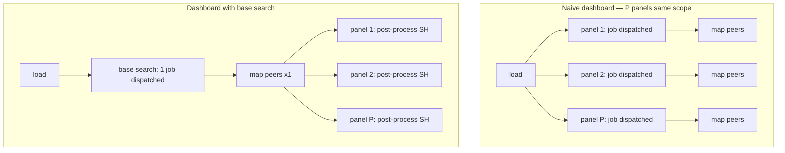

# Chapter 07 — UI rendering (time impact, bounded)

> 🇫🇷 **Version française disponible** : [`../07-restitution-ui.md`](../07-restitution-ui.md)

> **Time stake** — The dashboard layer does not consume time *within* a
> search: it **multiplies the number** of them. Each panel is a dispatched
> job, each auto-refresh re-dispatches, each token-driven input relaunches
> a search. A poorly built dashboard turns a click into dozens of concurrent
> jobs against the same dataset, and a healthy platform into a search queue
> saturated during business hours. The symptom does not read first in the Job
> Inspector of an isolated panel but in the **number of jobs per load**
> (`_audit action=search` filtered by app, browser network tab) and in the
> scheduler load attributable to the refresh. After this chapter, you can count
> the dispatches of a dashboard, make them drop through a shared base search,
> time range bounds and a conservative cadence — without spilling over into the
> UI **construction**, covered elsewhere.

## Mechanical recap

In the rendering layer, the unit of cost is not the SPL command but the
**job**. On opening a dashboard, each panel that carries its own
search dispatches an independent job: a dashboard with P panels of the same scope
issues P distributed searches to the peers, P times the same map. A **base
search** breaks this multiplication: it runs the common portion once,
and each panel **post-processes** it — a `|` chaining evaluated on the
search head, **without a new dispatch to the peers** (see
[Use base searches](https://docs.splunk.com/Documentation/Splunk/9.4/Viz/Savedsearches)).
One indexer read for P panels instead of P.

Three other mechanisms relaunch jobs: the **auto-refresh** re-dispatches the
panels at the set interval; a token-driven **input** (dropdown,
multiselect) runs its own population search on each value change; a
**drilldown** opens a search that inherits time range and tokens from the
source unless explicitly bounded. In 9.x two runtimes coexist — **Dashboards
Studio** (JSON) and **Classic SimpleXML** — with distinct token and
drilldown models (see
[Dashboards Studio overview](https://docs.splunk.com/Documentation/Splunk/9.4/DashStudio/Overview)).
The **construction** of these objects (base search syntax, `$token$`, drilldown)
is fully covered on the power-user side (D3 cross-reference); this chapter retains only
its **time impact**.

## Time decomposition of this phase

The "time" of a dashboard is the sum of the jobs it dispatches, not the duration
of a single one. Two load topologies, two costs:



The instruments that expose this cost, from the most global to the finest:

- **Number of jobs dispatched per load** — the cardinal instrument of this
  chapter. Two readings: the **browser network tab** (one POST request
  `/services/search/jobs` per job dispatched on opening) and `_audit
  action=search` filtered by `app` over the load window, which counts the
  jobs and exposes `total_run_time`, `scan_count`, `workload_pool` per search.
- **Job Inspector per panel** — for a given panel, you re-read there the markers
  of chapter 00: `scanCount`/`eventCount` (is the panel's time range
  bounded?), `command.search.rawdata` vs `command.search.index` (does the panel read
  raw where a `tstats` would suffice?), `dispatch.stream.remote.<peer_guid>`.
- **Scheduler/dispatch load attributable to the refresh** — `metrics.log
  group=search_concurrency` (slots occupied) and `group=searchscheduler` correlated to
  the cadence: an indexer load that persists while nobody is looking at
  the screen betrays an auto-refresh left open.
- **Time of the input jobs** — the `elapsedTime`/`total_run_time` of the search
  that populates a dropdown; an input backed by a `stats values()` over open
  time appears there as a full base search hidden behind a widget.

Cardinal reading rule: before optimizing a panel, **count the jobs of the
load**. A dashboard that dispatches 30 jobs for 30 views of the same scope is
fixed by a base search, not by accelerating each panel in isolation.

## Action levers

- **Lever — shared base search + post-process** for any dashboard where two
  panels or more share the scope (`index`/`sourcetype`/time range). Promote
  the common prefix to a base search, rewrite each panel as a post-process after
  the `|`.
  - **Expected time effect** — in 9.x, a base search takes the indexer
    cost from P reads to **a single one**: the base job dispatches once to
    the peers, the post-processes are computed on the search head without re-dispatching
    (see [Use base searches](https://docs.splunk.com/Documentation/Splunk/9.4/Viz/Savedsearches)).
  - **How to measure it** — number of jobs dispatched at load, before/after:
    `_audit action=search` filtered by `app` (or the network tab) shows P jobs that
    fall to 1 base + post-process.
  - **Boundary** — *self-contained* for the time decision (share the
    scope); *D3 cross-reference* for the **construction** of the base search and the chainings.

- **Lever — conservative refresh cadence**: manual refresh by
  default; if auto-refresh is necessary, push the interval to several
  minutes; never 30 s on a dashboard left open by several people.
  - **Expected time effect** — each refresh re-dispatches the panel jobs.
    A dashboard with P panels on 30 s auto-refresh, open on N workstations, generates
    on the order of `2·P·N` dispatches per minute against the same dataset, including
    when nobody is looking — a scheduler cost with no value.
  - **How to measure it** — load attributable to the dashboard: `metrics.log
    group=search_concurrency` (slot peak) and the `_audit action=search` count
    of the dashboard's searches over time, correlated to the cadence.
  - **Boundary** — *self-contained*.

- **Lever — default time range bounds + bounded drilldown**: set a tight
  default time range (never *All time*, snap `@h`/`@d`) and bound every
  drilldown with an explicit window (`earliest`/`latest` passed through).
  - **Expected time effect** — the default time range conditions the
    `scanCount` of **each** panel (buckets eligible for map, chapter 04); an
    unbounded drilldown opens on click a search over *All time*, paying a full
    map where the user thought they were paying for a window (see
    [How to optimize searches](https://docs.splunk.com/Documentation/Splunk/9.4/Search/Optimizesearches)).
  - **How to measure it** — `scanCount` per panel (Job Inspector of the
    panel job); after a drilldown, check `earliest`/`latest` in the Job
    Inspector of the resulting job.
  - **Boundary** — *self-contained* for the decision to bound; *D3 cross-reference* for the
    syntax of the drilldown tokens.

- **Lever — back single-value scorecards with `tstats`/an accelerated DM**:
  populate the single-value tiles via `tstats` against an indexed field or an accelerated data
  model, never a `stats` on raw.
  - **Expected time effect** — `tstats` reads the tsidx instead of decompressing
    `journal.gz`: `command.search.rawdata` drops to ~0 and a row of four
    tiles costs on the order of four indexed lookups instead of four full
    raw reads — fast enough to allow a manual refresh.
  - **How to measure it** — *Execution costs* of the tile job: `command.search.rawdata`
    ~0, `command.search.index` dominates; compare a `stats` vs `tstats` variant.
  - **Boundary** — *D3 cross-reference* to ch06 for the `tstats`/acceleration mechanics and the
    coverage sizing.

- **Lever — bound the inputs**: feed a dropdown with a `lookup` (e.g.
  `assets.csv`) or a recent `tstats` against an indexed field, not a `stats
  values()` over open time.
  - **Expected time effect** — the input dispatches its own job on
    display and on each value change; an unbounded `stats values()` is
    a full base search hidden behind a widget, when an `inputlookup` renders
    in tens of milliseconds and does not swell to thousands of values during
    an incident.
  - **How to measure it** — time of the input job: `total_run_time` of the
    population search in `_audit action=search`, or `elapsedTime` of its Job
    Inspector.
  - **Boundary** — *self-contained*.

- **Lever — avoid the Studio/Classic mix and dashboards with 30 panels of the same
  scope**: choose one runtime per dashboard; cap the number of panels and
  consolidate those of the same scope behind a base search; split by scope rather
  than stack.
  - **Expected time effect** — 30 panels of the same scope means 30 concurrent
    dispatches at load — a burst that saturates search concurrency;
    mixing Studio and Classic duplicates the definitions and prevents the sharing of a
    base search (the two runtimes share neither token contract nor base search).
  - **How to measure it** — number of concurrent jobs per load (network
    tab; `metrics.log group=search_concurrency` peak); `_audit` count per
    load.
  - **Boundary** — *self-contained* for the decision to split/cap; *D3
    cross-reference* for the choice and the Studio vs Classic patterns.

## Costly anti-patterns

- **Thirty panels re-querying the same scope.** Each panel pays a read
  of the same events. Marker: peak of the indexer search queue on the mere
  load of the page, `_audit action=search` counting P nearly
  simultaneous jobs. Fix: base search + post-process; if the scopes truly
  differ, split into several dashboards.
- **30 s auto-refresh left by default.** An inactive dashboard consumes the same
  scheduler budget as a driven dashboard, without producing value. Marker:
  indexer load that correlates with no presence in front of the screen, slots
  occupied continuously in `group=search_concurrency`. Fix: manual refresh
  by default, documented exceptions for live monitoring views.
- **Drilldown opening a search without a time bound.** A curious click pays
  one search; a poorly configured drilldown pays many silently.
  Marker: huge `scanCount` and `earliest`/`latest` absent in the Job
  Inspector of the drilldown job. Fix: pass through the bounds of the source.
- **Input backed by a `stats values()` over open time.** The dropdown takes
  seconds to populate and swells to thousands of entries. Marker:
  high `total_run_time` of the input job in `_audit`. Fix: `lookup` or
  `tstats` over a short window against an indexed field.
- **Tables with 50 columns "just in case".** Each column is a search-time
  extraction that the search head materializes. Marker: high `command.search.kv`
  on the panel job, rendering that drags. Fix: display only the
  columns that carry the decision, the rest behind a row drilldown.

## Worked examples

### Counting the jobs of a slow dashboard, then making them drop

A dashboard `payments_dashboards` with six panels "drags" on opening. Before
touching a single panel, you count the dispatches over the load window:

```spl
index=_audit action=search info=granted app=payments_dashboards
    earliest=-5m@m latest=now
| stats count AS dispatched_jobs by user
```

What you read: `dispatched_jobs` is 6 per load and per user — six
indexer reads of the same scope. The six panels share the prefix
`index=main sourcetype=access_combined earliest=-24h@h latest=now`. You promote it
to a base search and rewrite each panel as a post-process (`| stats count by
status`, `| timechart count by host`, …). New count: `dispatched_jobs`
falls to 1. In the Job Inspector of the base job, `dispatch.stream.remote.<peer_guid>`
appears only once; the panels no longer figure there because they are computed
as post-process on the search head.

### A row of scorecards raw vs `tstats`

A row of four single-value tiles (events 24 h, unique sources, error
rate, 7-day delta) is written naively with `stats` on raw:

```spl
index=security earliest=-24h@h latest=now
| stats count
```

What you read in the Job Inspector of the tile: `command.search.rawdata` dominates (each
event decompressed from `journal.gz`), `scanCount` far higher than `resultCount`.
Rewritten as `tstats` against the indexed field:

```spl
| tstats count where index=security earliest=-24h@h latest=now
```

What you read after: `command.search.rawdata` ~0, `command.search.index` dominates;
the tile renders almost instantly. Four tiles then cost four indexed
lookups instead of four raw reads. The `tstats`/acceleration mechanics is in
chapter 06.

### An unbounded drilldown, fixed by two tokens

A panel of a dashboard scoped to 24 h carries a drilldown that opens
`index=main sourcetype=access_combined status=<clicked value>` without a bound. On click,
the search starts on the user's last time range — often *All time*.

What you read in the Job Inspector of the drilldown job: `earliest`/`latest` absent or
very wide, `scanCount` out of all proportion with the source panel. The fix
is not a rewrite but passing through the bounds of the source (the tokens
`earliest`/`latest` of the dashboard) to the drilldown; you re-check once in the Job
Inspector after deployment that the resulting job is indeed bounded. The **syntax** of
these tokens is covered on the power-user side (cross-reference below).

## Conditional cross-references (D3)

- **Dashboard construction: base searches, post-process, tokens, drilldown,
  Studio vs Classic** —
  [`../../splunk-user-handbook/05-dashboards-and-visualizations.md`](../../splunk-user-handbook/05-dashboards-and-visualizations.md).
  The UI patterns (how to write a base search and its post-processes, the
  `$token$` syntax, the construction of a drilldown, the Studio/Classic choice) are
  **fully covered** there; the lever retained here is: a shared base search takes
  N dispatches to a single one, measurable in the **number of jobs per load**
  (`_audit action=search` by app, network tab).
- **`tstats`, data model acceleration, time cost/benefit of acceleration** —
  [`06-acceleration-comme-levier.md`](06-acceleration-comme-levier.md).
  The mechanics and the sizing of acceleration are covered there; the lever
  retained here is: backing a single-value scorecard with `tstats`/an accelerated DM
  removes the rawdata decompression, visible by `command.search.rawdata` ~0 in
  the *Execution costs* of the tile job.
- **Vocabulary of the markers (Job Inspector, `_audit`, `metrics.log`)** —
  [`00-modele-temporel-et-mesure.md`](00-modele-temporel-et-mesure.md).
  `scanCount`, `command.search.rawdata`, `dispatch.stream.remote`, `_audit
  action=search`, `metrics.log group=search_concurrency` are defined once there;
  this chapter reuses them without redefining them.

## Sources

- [Splunk Dashboards and Visualizations 9.4 — Use base searches and post-process searches](https://docs.splunk.com/Documentation/Splunk/9.4/Viz/Savedsearches)
- [Splunk Dashboards and Visualizations 9.4 — Dashboards Studio overview](https://docs.splunk.com/Documentation/Splunk/9.4/DashStudio/Overview)
- [Splunk Dashboards and Visualizations 9.4 — About tokens (Studio)](https://docs.splunk.com/Documentation/Splunk/9.4/DashStudio/AboutTokens)
- [Splunk Dashboards and Visualizations 9.4 — Classic SimpleXML](https://docs.splunk.com/Documentation/Splunk/9.4/Viz/AboutdashboardsandSimpleXML)
- [Splunk Search Manual 9.4 — Use the Job Inspector](https://docs.splunk.com/Documentation/Splunk/9.4/Search/ViewsearchjobpropertieswiththeJobInspector)
- [Splunk Search Manual 9.4 — About jobs and job management](https://docs.splunk.com/Documentation/Splunk/9.4/Search/Aboutjobsandjobmanagement)
- [Splunk Search Manual 9.4 — How to optimize searches](https://docs.splunk.com/Documentation/Splunk/9.4/Search/Optimizesearches)
- [Splunk Troubleshooting Manual 9.4 — About metrics.log](https://docs.splunk.com/Documentation/Splunk/9.4/Troubleshooting/Aboutmetricslog)
- [Splunk Splexicon — canonical definitions (base search, post-process search, token, drilldown)](https://docs.splunk.com/Splexicon)
