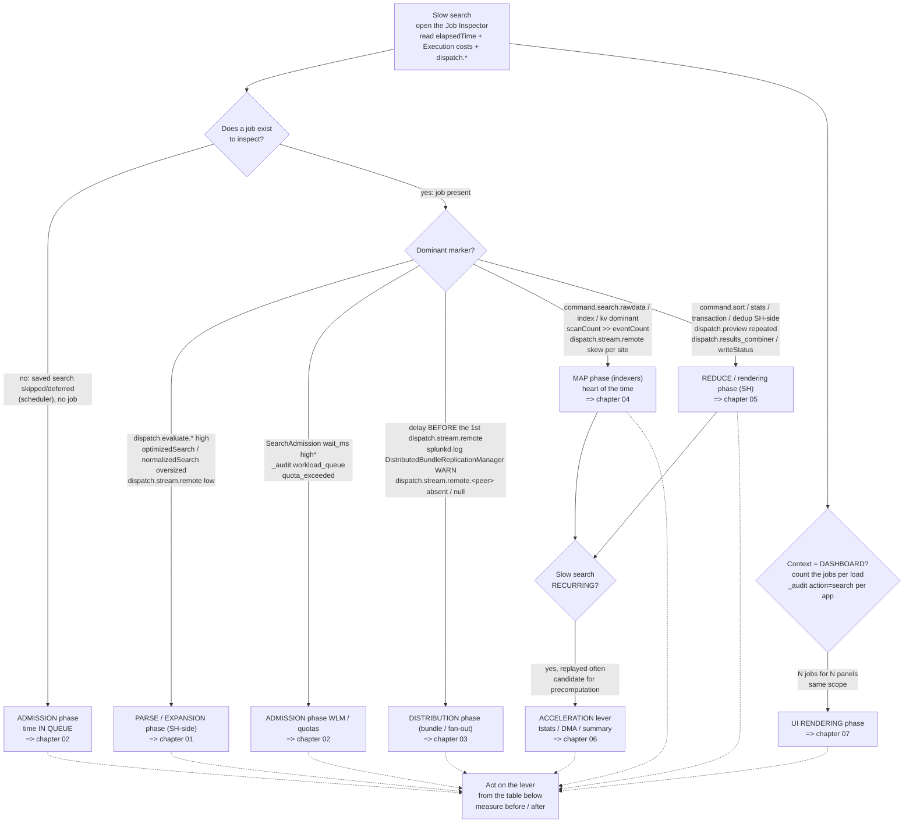

# Chapter 99 — Cheatsheet: decompose a time

> 🇫🇷 **Version française disponible** : [`../99-cheatsheet-decomposer-un-temps.md`](../99-cheatsheet-decomposer-un-temps.md)

> **Stake** — Self-contained, printable reference page. When facing a slow
> search, open its **Job Inspector** (**Job → Inspect Job**), spot the dominant
> marker — the largest *Execution costs* item, the heaviest `dispatch.*`,
> or the instrument outside the Job Inspector when the time is *in queue* — then
> follow the tree below down to the phase, the chapter and the lever. The
> consolidated table aggregates the levers of chapters 00-07: each row reads from
> an observable symptom to its fix. The vocabulary of the markers is defined in
> [chapter 00](00-modele-temporel-et-mesure.md) and is not redefined here.

## Decision tree — "where did the time go?"

Start from the **dominant** marker. The golden rule (chapter 00): never conclude
on the total wallclock (`elapsedTime`) without having decomposed it into items.

> \* `SearchAdmission wait_ms` is a marker **observed** in `index=_internal`
> in 9.x, with no dedicated Splunk documentation page: confirm its presence on
> your instance before making it a normative reference (chapter 02).

**Two reading pitfalls before entering the table**:

- A *skipped* saved search has **no job**: its time is not in the Job
  Inspector but in `index=_internal sourcetype=scheduler`. Do not look for an
  `elapsedTime` that does not exist (chapter 02).
- A delay **before** the first `dispatch.stream.remote` is on the bundle/fan-out side
  (chapter 03); a delay **within** the `dispatch.stream.remote` is on the map side
  (chapter 04). The same screen, two phases.

## Consolidated table — symptom → lever

Each row aggregates a lever from a chapter 00-07. Columns: **Observable
symptom** (Job Inspector field / log) | **Phase** | **Chapter** | **Main
lever** | **Verification instrument**.

| Observable symptom (Job Inspector / log) | Phase | Ch. | Main lever | Verification instrument |
| --- | --- | --- | --- | --- |
| `scanCount` >> `eventCount` on every search; time picker on *All time* | Cross-cutting | 00 | Bound the time range (explicit interval / `earliest`/`latest`) | `scanCount`; `search.log` `IndexScopedSearch` |
| `command.search.typer`/`kv`/`tags` high in everyday usage | Cross-cutting | 00 | Choose the `fast` mode rather than `verbose` | *Execution costs* compared `fast` vs `verbose` |
| `elapsedTime` long with no item identified | Cross-cutting | 00 | Read the Job Inspector (dominant item + `dispatch.*`) before acting | largest *Execution costs* item / `dispatch.*` relative to `elapsedTime` |
| `optimizedSearch` with no index predicate; `scanCount` >> `eventCount` | Parse SH-side | 01 | Push the predicates (`index`/`sourcetype`/`host`) into the base search | `optimizedSearch`; `scanCount` vs `eventCount` |
| `normalizedSearch`/`optimizedSearch` oversized; `command.search.tags` high | Parse SH-side | 01 | Master the expansion: target `index`/`sourcetype` in addition to `tag=`/`eventtype=` | `normalizedSearch` size; `search.log` `UnifiedSearch - Expanded search` |
| SH-side weight (`command.stats`/`sort`) high, `dispatch.stream.remote` low | Parse SH-side | 01 | Do not break the streaming-ness (transforming as late as possible) | share of `dispatch.stream.remote` vs SH-side items |
| significant `command.search.lookups`/`calcfields`/`fieldalias` | Parse SH-side | 01 | Audit and disable useless automatic KOs (`LOOKUP-*`/`EVAL-*`) (admin) | `command.search.lookups`/`calcfields`/`fieldalias` |
| no job to inspect; `status=skipped`/`deferred`; crons aligned on `*/5` | Admission | 02 | Spread the crons (`schedule_window`, `allow_skew`) | `sourcetype=scheduler status=skipped OR deferred`; `metrics.log group=searchscheduler` |
| high `skipped/total` ratio, saturated slots | Admission | 02 | Tune concurrency (`max_searches_perc`, `base_max_searches`) — admin | `metrics.log group=search_concurrency`; `skipped/total` ratio |
| high `wait_ms`\*; `_audit action=workload_queue` at peaks | Admission | 02 | Route the search to the right WLM pool / `queue` admission rule | `SearchAdmission wait_ms` (p50/p99); `_audit workload_pool`/`workload_queue` |
| `dispatch_time` far later than `scheduled_time` for a critical report | Admission | 02 | Prioritize (`schedule_priority = higher`) | `sourcetype=scheduler`: `dispatch_time` vs `scheduled_time` |
| `quota_exceeded` in `_audit` (503 rejection, not a slowdown) | Admission | 02 | Adjust the role's `srchJobsQuota` (admin) | `_audit action=search` occurrences of `quota_exceeded` |
| delay before any `dispatch.stream.remote`; large bundle | Distribution | 03 | Limit the bundle size (`maxBundleSize`) / move large lookups out (`replicationBlacklist`, KV Store) | size under `var/run/searchpeers/`; `splunkd.log` `DistributedBundleReplicationManager` |
| long replication cycles on many peers | Distribution | 03 | Choose the replication mode (`cascading` beyond ~15-20 peers, `mounted`) | cycle duration `splunkd.log DistributedBundleReplicationManager` |
| `WARN DistributedBundleReplicationManager … took too long` on a peer | Distribution | 03 | Deliberately tune the timeouts (`connectionTimeout`/`sendRcvTimeout`) | occurrences of `WARN … took too long` + named peer |
| fixed latency independent of the time range; `dispatch.stream.remote.<peer>` absent/null | Distribution | 03 | Keep the `serverList` clean (remove a dead peer / delegate to the CM) | `| rest /services/search/distributed/peers` (status); missing `dispatch.stream.remote` |
| `command.search.rawdata` dominant; `scanCount` >> `eventCount` | Map | 04 | Tighten the time range / reduce rawdata materialization (`fields` early) | `scanCount`, `eventCount`; `command.search.rawdata` |
| `command.search.index` high; leading wildcard `*foo` or primary `NOT`/`!=` | Map | 04 | Maximize the selectivity of indexed terms (rare positive term first) | `command.search.index`; `search.log` `LispyEvaluator` |
| `command.search.rawdata` dominant on an aggregate of indexed fields | Map | 04 | Switch to `tstats` (stays in the tsidx) | drop in `command.search.rawdata` between `stats`/`tstats` variants |
| systematic `dispatch.stream.remote.<peer>` skew per site | Map | 04 | Guarantee search affinity (`site_search_factor` ≥ 1 per site) — CM admin | `dispatch.stream.remote` skew per site; `remote_searches.log` |
| `command.search.kv`/`calcfields` dominant on a hot sourcetype | Map | 04 | Lighten the search-time extraction / promote to index-time — admin | `command.search.kv`/`calcfields` before/after |
| map slowdown correlated with an ongoing fixup/rebalance | Map | 04 | Rebalance with `-searchable true`, outside the critical window — CM admin | `| rest /services/cluster/manager/buckets` and `.../peers` |
| `command.sort` dominant; massive `resultCount` | Reduce | 05 | Bound early (`| head N`, `maxResultRows`) / push to `prestats` | `command.sort`, `resultCount`; shift `command.stats`→`command.prestats` |
| `command.transaction`/`dedup` dominant | Reduce | 05 | Avoid centralized commands (`transaction`→`stats earliest()/latest() by`) | `command.transaction`/`dedup` before/after |
| `dispatch.preview` with many invocations on a heavy search | Reduce | 05 | Space out/disable the preview (`preview=false`) or batch mode | `dispatch.preview` (invocations + duration) |
| large dispatch dir; `dispatch.writeStatus` dragging | Reduce | 05 | Tune the job artifact TTL (`dispatch.ttl`) | volume under `var/run/splunk/dispatch/`; `dispatch.writeStatus` |
| **recurring** slow search covered by a DM; `command.search.rawdata` dominant | Acceleration | 06 | Route to `tstats summariesonly=t` on an accelerated DM | *Execution costs* `stats` vs `tstats`; `| datamodel <dm> summarize` |
| counts that drop at a fixed offset from `now()` | Acceleration | 06 | Size `acceleration.max_time` on the actual window (admin) | `| datamodel <dm> summarize` (covered range) |
| heavy recurring aggregate kept a long time; raw rescan | Acceleration | 06 | Summary indexing (`summary_app01`) fed by a scheduled search | `summary_app01` size; `sourcetype=scheduler run_time`; `command.search.rawdata` ~0 |
| N jobs dispatched for N panels of the same scope | UI rendering | 07 | Shared base search + post-process | `_audit action=search` per `app`; browser network tab |
| persistent indexer load with no one in front of the screen | UI rendering | 07 | Conservative refresh cadence (manual refresh by default) | `metrics.log group=search_concurrency` correlated with the cadence |
| huge `scanCount`, `earliest`/`latest` absent on a drilldown job | UI rendering | 07 | Default time range bounds + bounded drilldown | `scanCount` per panel; `earliest`/`latest` of the drilldown Job Inspector |
| high `total_run_time` of an input job (`stats values()` over open time) | UI rendering | 07 | Bound the inputs (recent `lookup`/`tstats`) | `total_run_time` of the input job in `_audit` |

## Mechanical recap

Nothing specific to this page — see [chapter 00](00-modele-temporel-et-mesure.md)
for the time model and the map of instruments, then the chapter pointed to by
the row of the table.

## Worked examples

Nothing specific — each pointed chapter carries its own worked examples
(before/after with a Job Inspector reading): see the *Worked
examples* sections of chapters [01](01-soumission-et-parsing-spl.md),
[02](02-admission-et-ordonnancement.md), [03](03-distribution.md),
[04](04-map-sur-indexeurs.md), [05](05-reduce-et-restitution.md),
[06](06-acceleration-comme-levier.md) and [07](07-restitution-ui.md).

## Costly anti-patterns

Nothing specific — see the *Costly anti-patterns* sections of the pointed
chapters, in particular the cross-cutting pitfall of [chapter 00](00-modele-temporel-et-mesure.md)
(concluding on `elapsedTime` without decomposing) and the *skipped* vs *slow* confusion
of [chapter 02](02-admission-et-ordonnancement.md).

## Sources

Aggregation of the sources of chapters 00-07; the normative reference for the markers
is the Search Manual (Job Inspector) at the top.

- [Splunk Search Manual 9.4 — Use the Job Inspector](https://docs.splunk.com/Documentation/Splunk/9.4/Search/ViewsearchjobpropertieswiththeJobInspector)
- [Splunk Search Manual 9.4 — About jobs and job management](https://docs.splunk.com/Documentation/Splunk/9.4/Search/Aboutjobsandjobmanagement)
- [Splunk Search Manual 9.4 — How to optimize searches](https://docs.splunk.com/Documentation/Splunk/9.4/Search/Optimizesearches)
- [Splunk Search Manual 9.4 — Built-in optimization](https://docs.splunk.com/Documentation/Splunk/9.4/Search/Builtinoptimization)
- [Splunk Search Manual 9.4 — Dispatch directory and search artifacts](https://docs.splunk.com/Documentation/Splunk/9.4/Search/Dispatchdirectoryandsearchartifacts)
- [Splunk Search Reference 9.4 — tstats](https://docs.splunk.com/Documentation/Splunk/9.4/SearchReference/Tstats)
- [Splunk Search Reference 9.4 — stats](https://docs.splunk.com/Documentation/Splunk/9.4/SearchReference/Stats)
- [Splunk Search Reference 9.4 — transaction](https://docs.splunk.com/Documentation/Splunk/9.4/SearchReference/Transaction)
- [Splunk Distributed Search Manual 9.4 — Knowledge bundle replication](https://docs.splunk.com/Documentation/Splunk/9.4/DistSearch/Knowledgebundlereplication)
- [Splunk Distributed Search Manual 9.4 — Limit the knowledge bundle size](https://docs.splunk.com/Documentation/Splunk/9.4/DistSearch/Limittheknowledgebundlesize)
- [Splunk Managing Indexers and Clusters of Indexers 9.4 — Multisite search affinity](https://docs.splunk.com/Documentation/Splunk/9.4/Indexer/Multisitesearchaffinity)
- [Splunk Capacity Planning Manual 9.4 — How search works](https://docs.splunk.com/Documentation/Splunk/9.4/Capacity/Howsearchworks)
- [Splunk Knowledge Manager Manual 9.4 — Accelerate data models](https://docs.splunk.com/Documentation/Splunk/9.4/Knowledge/Acceleratedatamodels)
- [Splunk Knowledge Manager Manual 9.4 — About summary indexing](https://docs.splunk.com/Documentation/Splunk/9.4/Knowledge/Aboutsummaryindexing)
- [Splunk Admin Manual 9.4 — limits.conf](https://docs.splunk.com/Documentation/Splunk/9.4/Admin/Limitsconf)
- [Splunk Admin Manual 9.4 — savedsearches.conf](https://docs.splunk.com/Documentation/Splunk/9.4/Admin/Savedsearchesconf)
- [Splunk Admin Manual 9.4 — distsearch.conf](https://docs.splunk.com/Documentation/Splunk/9.4/Admin/Distsearchconf)
- [Splunk Troubleshooting Manual 9.4 — About metrics.log](https://docs.splunk.com/Documentation/Splunk/9.4/Troubleshooting/Aboutmetricslog)
- [Splunk Dashboards and Visualizations 9.4 — Use base searches and post-process searches](https://docs.splunk.com/Documentation/Splunk/9.4/Viz/Savedsearches)
- [Splunk Workload Management 9.4 — Overview](https://help.splunk.com/en/splunk-enterprise/administer/manage-workloads/9.4/workload-management-overview)
