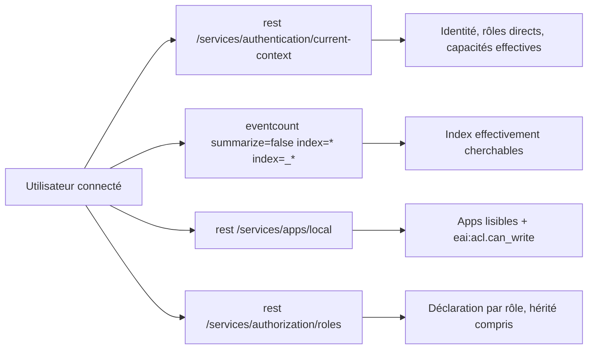

# Dashboard « Mes droits »

Source : [`mes-droits.xml`](./mes-droits.xml) (SimpleXML, `version="1.1"`).

Répond à la question d'un utilisateur : « qu'ai-je le droit de faire ? », surtout en termes
d'**index** et d'**apps**. Aucune saisie : tout est calculé pour l'utilisateur connecté.

## Principe : mesurer l'effectif plutôt que recalculer la déclaration

Recalculer les droits depuis la configuration des rôles (héritage, jokers dans
`srchIndexesAllowed`, ACL des apps) en SPL est fragile. Le dashboard interroge plutôt des
endpoints et commandes qui **filtrent déjà selon les droits de l'appelant** :

| Panneau | Source | Ce qui est effectif |
|---|---|---|
| Identité, compteurs | `current-context` | rôles directs, capacités (héritage résolu) |
| Index | `eventcount` | ne renvoie que les index cherchables par l'appelant |
| Apps | `apps/local` | ne renvoie que les apps lisibles ; `eai:acl.can_write` calculé pour l'appelant |
| Déclaration par rôle | `authorization/roles` | `srchIndexesAllowed`/`Default`, `imported_*`, `srchFilter`, quotas |
| Capacités | `current-context` | liste complète |

Les panneaux index et apps donnent la vérité terrain ; le panneau par rôle explique **d'où**
elle vient.

## Interactions

- Filtres : index internes `_*` masqués par défaut, apps non visibles (TA/SA) masquées par défaut.
- Clic sur un index : recherche sur les 15 dernières minutes.
- Clic sur une app : ouverture de l'app.

## Pré-requis et limites

- **`rest_properties_get`** : tout le dashboard repose sur `| rest`. Capacité présente dans le
  rôle `user` par défaut ; à vérifier sur un rôle maison qui n'en hérite pas.
- **`/services/authorization/roles`** : lisibilité par un non-admin non vérifiée. Si le
  panneau « Déclaration par rôle » reste vide ou renvoie un 403, le supprimer : les panneaux
  index et apps restent justes.
- **Index metrics** : `eventcount index=*` peut ne pas les lister ; prévoir un panneau
  `mcatalog` si besoin.
- **`splunk_server=local`** : les appels `rest` interrogent le search head courant, ce qui est
  le bon périmètre pour les rôles et les apps.
- Testé : bonne formation XML seulement. À valider sur un compte non admin avant diffusion.
