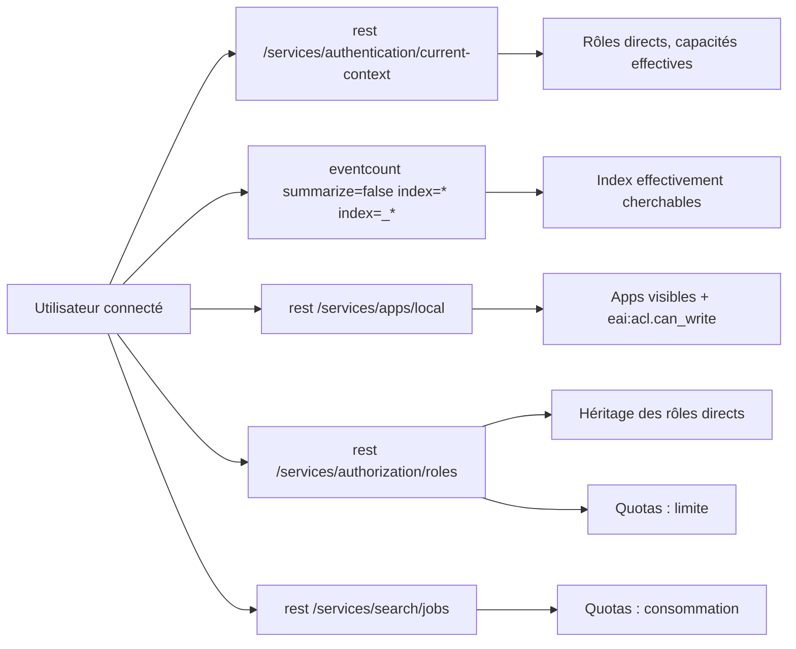

# Dashboard « My Accesses »

Source : [`my-accesses.xml`](./my-accesses.xml) (SimpleXML, `version="1.1"`, libellés en anglais).

Répond à la question d'un utilisateur : « qu'ai-je le droit de faire, et où en suis-je de mes
quotas ? ». Aucune saisie : tout est calculé pour l'utilisateur connecté.

## Principe : mesurer l'effectif plutôt que recalculer la déclaration

Recalculer les droits depuis la configuration des rôles (héritage, jokers dans
`srchIndexesAllowed`, ACL des apps) en SPL est fragile. Le dashboard interroge plutôt des
endpoints et commandes qui **filtrent déjà selon les droits de l'appelant** :

| Panneau | Source | Contenu |
|---|---|---|
| Direct roles | `current-context` | rôles directement assignés, en nuage de mots |
| Role inheritance | `authorization/roles` | rôles directs et rôles qu'ils importent |
| Searchable indexes | `eventcount` | index cherchables par l'appelant, filtre texte + type |
| Apps | `apps/local` | apps visibles seulement : `label`, accès `read` ou `read/write` (`eai:acl.can_write`), `id` |
| Search quotas | `authorization/roles` + `search/jobs` | limite, consommation courante, % coloré (70 / 90) |
| Effective capabilities | `current-context` | liste complète, héritage résolu |

## Quotas : limite et consommation

| Paramètre | Limite (`authorize.conf`) | Consommation |
|---|---|---|
| Concurrent searches | `srchJobsQuota` | jobs de l'utilisateur non terminés, hors temps réel, hors planificateur |
| Concurrent real-time searches | `rtSrchJobsQuota` | jobs temps réel non terminés |
| Search results disk space (MB) | `srchDiskQuota` | somme des `diskUsage` des artefacts de l'utilisateur |
| Max time range per search | `srchTimeWin` | sans objet |
| Earliest searchable time | `srchTimeEarliest` | sans objet |
| Search filter | `srchFilter` | sans objet |

Valeur effective sur plusieurs rôles : la plus permissive (maximum pour les quotas, illimité
si une valeur est `<= 0` pour les fenêtres de temps, filtres combinés en `OR`). Les valeurs
`imported_*` portent l'héritage.

## Interactions

- Index : filtre texte (sous-chaîne, jokers acceptés), internes `_*` masqués par défaut ; clic
  = recherche sur les 15 dernières minutes.
- Apps : clic = ouverture de l'app.

## Pré-requis et limites

- **Tag Cloud** : le panneau « Direct roles » demande l'app de visualisation Tag Cloud. Le type
  `viz_tag_cloud.tag_cloud` est à confirmer dans son `default/visualizations.conf` (nom de
  l'app + nom du stanza) ; sans l'app, remplacer par un `<table>`.
- **`rest_properties_get`** : tout le dashboard repose sur `| rest`. Capacité présente dans le
  rôle `user` par défaut ; à vérifier sur un rôle maison qui n'en hérite pas.
- **`/services/authorization/roles`** : lisibilité par un non-admin non vérifiée. Si
  « Role inheritance » et « Search quotas » restent vides ou renvoient un 403, c'est la cause.
- **Quotas** :
  - Consommation lue sur le search head courant (`splunk_server=local`). En SHC avec
    application des quotas à l'échelle du cluster, elle est sous-estimée.
  - La règle « valeur la plus permissive » et le sens de `0` / `-1` pour les fenêtres de
    temps sont à confirmer avec la doc `authorize.conf` de la version cible.
- **Index metrics** : `eventcount index=*` peut ne pas les lister ; prévoir un panneau
  `mcatalog` si besoin.
- Testé : bonne formation XML seulement. À valider sur un compte non admin avant diffusion.
