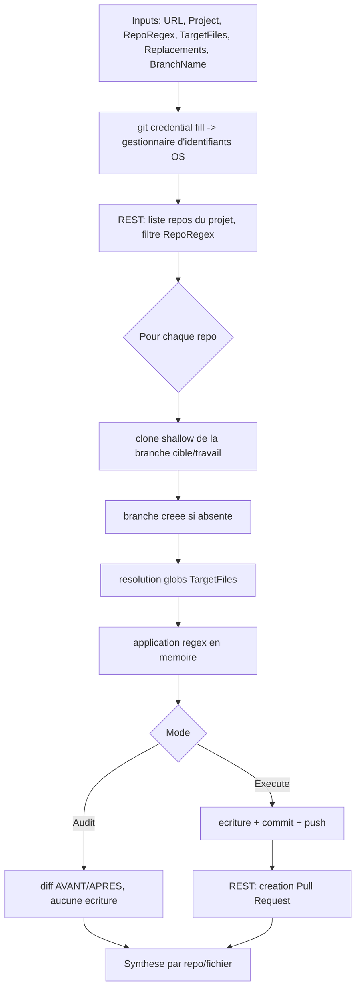

# Bitbucket — édition de masse de repos (apps Splunk)

`Invoke-SplunkBitbucketBulkEdit.ps1` — édition de masse de fichiers dans les repos d'un
projet **Bitbucket Server / Data Center**, filtrés par regex. Pensé pour des applications
Splunk (structure N1 : `local/`, `bin/`, `default/`, `metadata/`...), mais applicable à
n'importe quel ensemble de repos.

Workflow par repo : **clone (shallow) → branche (créée si absente) → transformations regex →
commit → push → Pull Request**.

## Modes

| Mode | Effet |
|---|---|
| `Audit` (défaut) | Simule tout. Affiche un **AVANT/APRÈS** par fichier. N'écrit / commit / push **rien**. |
| `Execute` | Applique réellement, commit, push la branche, ouvre la PR. Idempotent (pas de commit si rien ne change). |

## Authentification

Aucun secret en paramètre. Le script récupère les identifiants via `git credential fill`,
qui lit le **gestionnaire d'identifiants de l'OS** (sous Windows : Credential Manager via le
helper `manager`/`manager-core` déjà utilisé par git pour le HTTPS). Le même couple
`user`/PAT sert au clone/push **et** aux appels REST (Basic auth). Pré-requis : s'être
authentifié une fois en HTTPS sur l'instance Bitbucket (un `git clone` suffit à mémoriser le
PAT), ou avoir ajouté l'identifiant générique dans le gestionnaire.

## Transformations

Liste de couples `regex → remplacement` (moteur **.NET**, pas `sed`).
Groupes de capture en syntaxe .NET : `$1`, `${nom}` (pas `\1`).
Fournies soit en ligne (`-Replacements`), soit via un fichier JSON (`-ReplacementsFile`,
cf. [`replacements.example.json`](./replacements.example.json)).

## Paramètres principaux

| Paramètre | Rôle |
|---|---|
| `-BitbucketUrl` | URL de base de l'instance (ex. `https://bitbucket.corp.example`). |
| `-Project` | Clé du projet (`<PROJECT_KEY>`), pas le nom affiché. |
| `-RepoRegex` | Regex .NET appliquée au slug et au nom des repos pour sélectionner les cibles. |
| `-TargetFiles` | Chemins/globs relatifs racine repo (ex. `default/*.conf`,`local/inputs.conf`). |
| `-Replacements` / `-ReplacementsFile` | Les transformations (in-line ou JSON). |
| `-BranchName` | Branche de travail, créée si absente. |
| `-TargetBranch` | Destination de la PR (défaut : branche par défaut du repo). |
| `-Mode` | `Audit` (défaut) ou `Execute`. |
| `-MaxRepos` | Garde-fou : nombre max de repos traités (0 = illimité). |

## Exemples

```powershell
# Audit (dry-run)
.\Invoke-SplunkBitbucketBulkEdit.ps1 -BitbucketUrl https://bitbucket.corp.example `
    -Project SPLK -RepoRegex '^ta_' `
    -TargetFiles 'default/*.conf','local/*.conf' `
    -ReplacementsFile .\replacements.example.json `
    -BranchName chore/reindex -Mode Audit

# Exécution réelle
.\Invoke-SplunkBitbucketBulkEdit.ps1 -BitbucketUrl https://bitbucket.corp.example `
    -Project SPLK -RepoRegex '^ta_' `
    -TargetFiles 'default/*.conf' `
    -ReplacementsFile .\replacements.example.json `
    -BranchName chore/reindex -TargetBranch master -Mode Execute
```

## Garde-fous / spécificités Splunk

- **Idempotent** : aucun commit ni PR si le repo ne change pas.
- **Surcharge `local/` > `default/`** : si une modif touche `default/<f>` alors qu'un
  `local/<f>` existe, un avertissement signale que la modif peut être sans effet à
  l'exécution Splunk.
- **Encodage et fins de ligne préservés** (CRLF/LF, BOM) pour ne pas polluer les diffs.
- Clones temporaires supprimés en fin de run réussi ; conservés en cas d'erreur ou avec
  `-KeepClones`.
- Gestion du `409` si la PR existe déjà (pas de doublon).

## Limites connues

- Le diff est aligné **ligne à ligne** : idéal pour les remplacements intra-ligne (cas
  `.conf`). Une règle ajoutant/supprimant des lignes reste lisible mais peut afficher un
  décalage cosmétique.
- Traitement **séquentiel** (pas de parallélisme), pour la lisibilité de l'audit.
- PR créée sans reviewers ni labels.

## Flux



## Pré-requis

- Git (sous Windows : Git for Windows, inclut `manager-core`) dans le `PATH`.
- PowerShell 5.1+. Le script est enregistré en **UTF-8 avec BOM** : nécessaire pour que
  PowerShell 5.1 lise correctement les accents (sans BOM, il interprète le fichier en ANSI).
- PAT Bitbucket avec droits *Repository write* sur le projet ciblé.
