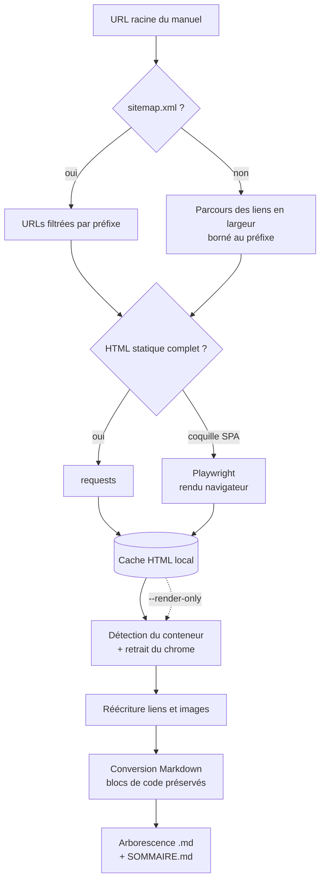

# Portail de doc HTML → arborescence Markdown

`splunk_help_to_md.py` — aspire un **manuel** d'un portail de documentation et le restitue
en arborescence Markdown : un `.md` par page, liens internes réécrits en chemins relatifs,
blocs de code annotés, index `SOMMAIRE.md`.

Écrit pour la structure d'URL d'un portail type `help.splunk.com`
(`/<langue>/<produit>/<section>/<manuel>/<version>/...`), mais **aucun sélecteur CSS n'est
en dur** : le conteneur de contenu est détecté par heuristique et reste surchargeable. Il
fonctionne donc sur n'importe quel portail de doc de structure comparable.

## Avant toute chose — usage et droit d'auteur

La documentation d'un éditeur est une **œuvre sous copyright**. Ce script produit une copie
locale de travail (lecture hors-ligne, recherche `grep`, diff entre deux versions) ; il ne
donne aucun droit de republication.

> **Ne jamais committer la sortie dans ce dépôt** : il est public. Le dossier de sortie par
> défaut est ignoré par git (cf. [`.gitignore`](../../.gitignore)), et le script n'écrit
> jamais dans l'arborescence du dépôt sans un `--out` explicite. Ce qui a sa place ici, ce
> sont des **notes dérivées** — synthèses, tableaux de correspondance, retours d'expérience
> — pas le texte de l'éditeur recopié.

Côté politesse : `robots.txt` est respecté par défaut, un délai sépare les requêtes, et le
User-Agent est explicite. Le renseigner (`--user-agent`) avec un contact est une bonne
pratique.

## Flux



Les deux phases sont séparées : la conversion relit le **cache**, jamais le réseau. On peut
donc réajuster les sélecteurs et reconvertir autant de fois que nécessaire sans retélécharger.

## Pré-requis

```bash
pip install requests beautifulsoup4 markdownify
pip install playwright && playwright install chromium   # seulement si le portail est une SPA
```

Si les navigateurs Playwright sont déjà fournis par le poste ou l'image :
`--browser-executable /chemin/vers/chromium` (ou la variable `CHROMIUM_EXECUTABLE`).

## Commandes

| Commande | Rôle |
|---|---|
| `probe <url>` | **Diagnostic, n'écrit rien.** Dit quel conteneur est retenu, combien de texte en sort, et affiche un aperçu du Markdown. À lancer en premier. |
| `crawl <url>` | Aspire le manuel vers `--out`. |

## Paramètres

| Paramètre | Rôle |
|---|---|
| `--out DIR` | Dossier de sortie (obligatoire pour `crawl`). |
| `--prefix URL` | Préfixe à ne pas quitter (défaut : l'URL racine). Sert à aspirer un sous-ensemble. |
| `--mode auto\|static\|browser` | `auto` (défaut) bascule en navigateur si le HTML brut est une coquille sans corps. |
| `--content-selector CSS` | Force le conteneur de contenu si l'heuristique se trompe (voir `probe`). |
| `--strip-selector CSS` | Élément à supprimer avant extraction. Répétable. |
| `--delay SEC` | Délai entre requêtes (défaut `1.0`). |
| `--max-pages N` | Garde-fou (défaut `500`). |
| `--render-only` | Reconvertit depuis le cache, **sans aucune requête réseau**. |
| `--download-images` | Récupère les images dans `_assets/` au lieu de pointer vers l'URL d'origine. |
| `--cache DIR` | Cache HTML (défaut `<out>/.cache`). |
| `--user-agent UA` | User-Agent annoncé. |
| `--browser-executable BIN` | Binaire Chromium pour `--mode browser`. |
| `--ignore-robots` | Passe outre `robots.txt`. **Sous votre responsabilité** — à n'utiliser que si vous savez pourquoi. |

## Exemples

```bash
# 1. Diagnostic : que voit le script sur une page ?
python3 splunk_help_to_md.py probe \
    https://help.splunk.com/en/splunk-enterprise/administer/admin-manual/9.4/welcome-to-splunk-enterprise-administration/how-to-use-this-manual

# 2. Aspiration complète du manuel
python3 splunk_help_to_md.py crawl \
    https://help.splunk.com/en/splunk-enterprise/administer/admin-manual/9.4 \
    --out ~/doc-splunk/admin-9.4 --delay 1.5 --download-images

# 3. L'heuristique a pris la mauvaise div : on force, et on reconvertit sans réseau
python3 splunk_help_to_md.py crawl <url> --out ~/doc-splunk/admin-9.4 \
    --content-selector 'main .topic-content' --strip-selector '.version-picker' \
    --render-only
```

Sortie produite :

```text
admin-9.4/
├── SOMMAIRE.md          — index hiérarchique, liens relatifs
├── index.md             — page racine du manuel
├── _assets/             — images (si --download-images)
├── welcome-to-....md
└── welcome-to-.../
    └── how-to-use-this-manual.md
```

Chaque page porte un front matter qui trace l'origine :

```yaml
---
source: https://help.splunk.com/en/...
title: "How to use this manual"
retrieved: 2026-09-18
---
```

## Garde-fous et limites

- **`robots.txt` d'abord.** Si le portail interdit l'exploration, le script s'arrête en le
  disant. C'est un signal à prendre au sérieux, pas un obstacle à contourner par réflexe.
- **Le portail peut changer sans préavis.** L'heuristique de détection encaisse les
  refontes mineures ; pour le reste, `probe` puis `--content-selector`.
- **Versions** : un portail qui versionne par branche mineure (`9.4`) n'a pas d'URL par
  patch (`9.4.6`). Le miroir porte la granularité du portail, pas celle de votre binaire.
- **Le rendu navigateur est lent** (~1 s/page en plus) et coûte un Chromium. Rester en
  `static` quand le HTML brut suffit.
- **Fidélité** : le Markdown restitue titres, listes, tableaux, code et liens. Les éléments
  interactifs (onglets, accordéons, sélecteurs de version) sont aplatis ou perdus.
- Relire avant de réutiliser un extrait ailleurs : la conversion n'est pas une relecture.
