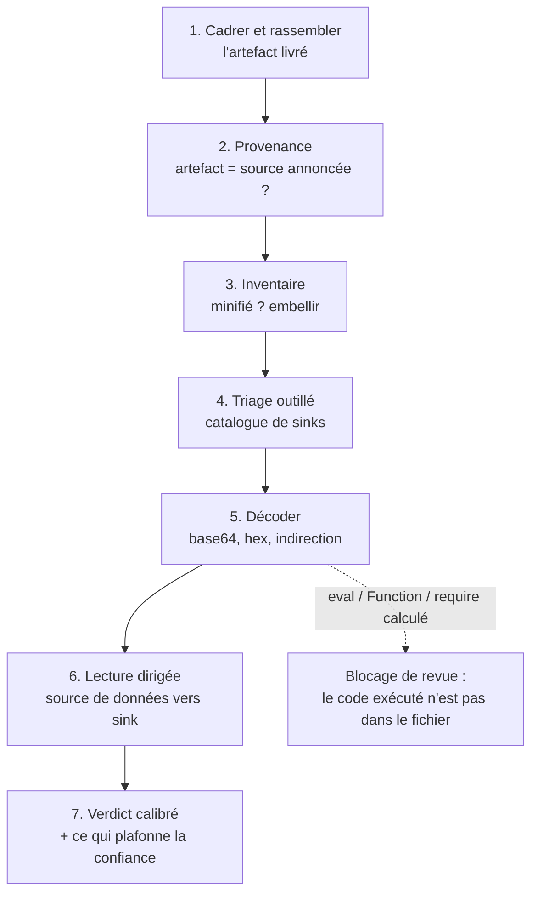

# revue-code-malveillant

Chercher l'**intention hostile** dans du code écrit par un tiers. Ce n'est pas une revue de
vulnérabilités type OWASP, et la confusion est la première cause d'audit raté : un scanner OWASP
cherche les erreurs d'un auteur qu'on suppose de bonne foi, dans du code qu'on possède. Ici
l'auteur **est** l'attaquant potentiel, et son code s'exécutera avec les droits de l'utilisateur.
Les deux exercices ne partagent ni les motifs recherchés, ni le critère de conclusion.

Cible de référence : l'add-on Obsidian, cas limite utile parce que l'application ne sandboxe pas
ses plugins et que le coffre contient à la fois les notes et les secrets des autres plugins. La
méthode se transpose à tout paquet JavaScript livré sous forme d'artefact.

**Règle absolue : ne jamais exécuter le code audité.** Ni `npm install` (les scripts
`postinstall` s'exécutent à l'installation), ni `node main.js`, ni l'application avec le plugin
activé. Lecture seule, du début à la fin.



## 1. Cadrer et rassembler

1. Noter l'identité de la cible : identifiant du plugin, version, dépôt, auteur, mode
   d'installation (catalogue officiel, installateur de dépôts arbitraires, archive reçue).
   **La présence au catalogue communautaire n'est pas une preuve de sûreté** : la revue d'entrée
   porte sur la première soumission, pas sur chaque version publiée ensuite.
2. Récupérer les fichiers **livrés**, dans un dossier de travail dédié, sans les exécuter.
3. Auditer **ce qui tourne**. Lire le dépôt à la place de l'artefact installé ne prouve rien :
   l'application n'exécute pas le dépôt, elle exécute le fichier livré.

## 2. Provenance

Répondre par un fait, pas par une impression :

- l'artefact livré correspond-il au dépôt annoncé ? Cloner le tag, `npm ci && npm run build`,
  comparer taille et chaînes. L'égalité binaire est rare (versions d'empaqueteur, horodatages) ;
  ce qui compte est l'apparition de chaînes, d'URL ou de blocs **absents de la source** ;
- version du manifeste = tag de la release ; l'auteur est-il le mainteneur du dépôt ;
- âge du dépôt, rythme des releases, changement récent de mainteneur ou de nom de paquet.
  La reprise d'un projet abandonné par un tiers est un vecteur classique de compromission ;
- réputation : recherche **bornée** (quelques requêtes, quelques pages), sur le seul nom public
  du paquet. Ne jamais transmettre à un outil de recherche externe un extrait du contenu audité,
  un nom d'hôte interne ou une donnée de l'utilisateur.

Provenance non vérifiable **et** code minifié : la confiance est plafonnée, et cela s'écrit dans
le verdict.

## 3. Inventaire et lisibilité

Inventorier les fichiers, leur taille et la **longueur de leur plus longue ligne**. Au-delà
d'environ 500 caractères, le code est minifié : l'embellir avant toute lecture, sinon les
expressions régulières mentent et l'œil ne voit rien.

```bash
npx --yes prettier@3 main.js > main.pretty.js
```

Distinguer deux phénomènes que l'on confond souvent :

- **minification** (noms de variables courts, espaces supprimés, chaînes lisibles) : normale, tout
  empaqueteur le fait ;
- **obfuscation** (tableau de chaînes encodées, identifiants `_0x…`, séquences `\x` en rafale,
  indirection systématique) : anormale. Aucun paquet honnête n'a de raison de cacher ses chaînes.
  C'est un résultat d'audit en soi, pas une gêne de lecture.

## 4. Triage outillé

Passer le catalogue de sinks (script en fin de fiche). Il ne remplace pas la lecture : il dit
**où** regarder. Sept familles, de la plus grave à la plus banale :

| Famille | Motifs | Justification acceptable |
|---|---|---|
| Exécution dynamique | `eval`, `new Function`, `import()`/`require()` à argument calculé | quasi aucune |
| Processus | `child_process`, `execSync`, `spawn`, ouverture shell, IPC, Electron | intégration d'un binaire tiers annoncé |
| Système de fichiers | `require('fs')`, `readFileSync`, `homedir`, `process.env` | chemin choisi par l'utilisateur |
| Réseau | `fetch`, `XMLHttpRequest`, `WebSocket`, `sendBeacon`, client HTTP de l'hôte | point de terminaison **configurable** et annoncé |
| Données en masse | énumération de tous les documents, lecture du dossier de configuration, `localStorage` | indexation locale, recherche |
| Obfuscation | `atob`, `fromCharCode`, `_0x…`, base64 long | aucune |
| Persistance | `setInterval`, tâche périodique, écouteur clavier global | autosauvegarde, rafraîchissement d'interface |

## 5. Décoder avant de conclure

La liste des hôtes en clair **ment** dès qu'il y a de l'encodage : c'est le piège principal de
l'audit outillé. Un artefact peut n'exposer que des domaines anodins en clair et porter son point
de collecte réel dans un littéral base64. Avant tout verdict réseau :

- décoder les littéraux base64, les `String.fromCharCode`, les suites `\x41\x42…` ;
- suivre les concaténations (`'https://' + a[3] + b`) et les tables d'indirection ;
- traiter tout `eval`, `new Function`, `import()` ou `require()` à argument non littéral comme un
  **trou noir** : le code réellement exécuté n'est pas dans le fichier. C'est un blocage de revue,
  pas une ligne de plus dans un rapport.

## 6. Lecture dirigée : de la source au sink

Pour chaque occurrence retenue, remonter le chemin complet et exiger qu'une **fonctionnalité
annoncée** le justifie.

| Source (donnée sensible) | Sink (sortie) |
|---|---|
| énumération des documents, lecture du dossier de configuration | requête HTTP, WebSocket, balise de mesure |
| configuration persistée des **autres** extensions, stockage local | exécution de processus, ouverture par le shell |
| `process.env`, répertoire personnel, lecture hors du périmètre applicatif | réécriture de l'artefact lui-même |

Un utilitaire de comptage de mots qui énumère tous les documents et les poste vers un domaine :
chemin d'attaque. Un client de synchronisation qui poste vers le point de terminaison configuré par
l'utilisateur : fonctionnalité. La question n'est jamais « cette API est-elle dangereuse » mais
« pourquoi **celle-ci**, **ici**, vers **là** ».

**Faux positifs à ne pas remonter comme findings** : requête vers l'API configurée par
l'utilisateur, minuterie d'autosauvegarde, `process.env.PATH` pour localiser un binaire,
stockage local pour un état d'interface, accès fichier sur un chemin choisi par l'utilisateur.
Un rapport qui crie au loup sur ces motifs sera ignoré la fois suivante, y compris quand il aura
raison.

## 7. Verdict

1. **Périmètre** : fichiers, version, empreinte (`sha256sum`), familles vérifiées, et surtout ce
   qui n'a **pas** pu l'être.
2. **Findings** par gravité, chacun avec un chemin d'attaque concret (*l'attaquant fait X, obtient
   Y*), fichier et ligne à l'appui. Sans chemin d'attaque, c'est un point de durcissement, pas un
   finding.
3. **Verdict** : ne jamais écrire « ce paquet est sûr ». Écrire « rien trouvé dans les familles
   vérifiées », avec le niveau de confiance et ce qui le plafonne (minification, provenance non
   reproductible, code dynamique).
4. **Recommandation** tranchée : installer, installer sous réserve (en nommant quoi surveiller),
   ne pas installer, ou analyse dynamique nécessaire.

L'analyse dynamique (machine jetable, jeu de données leurre avec canaris, capture réseau) exécute
du code potentiellement hostile : elle se **demande**, elle ne se décide pas seule.

## 8. Capitaliser

Consigner identifiant, version, empreinte, date et décision. La version suivante ne sera alors pas
réauditée de zéro : seul le différentiel compte. Corollaire : **un verdict porte sur une version et
une empreinte**, jamais sur un nom de paquet.

## Référence : modèle de menace d'un add-on Obsidian

### Ce qu'un plugin peut faire

L'application de bureau est une application Electron **sans sandbox pour les plugins** : un plugin
communautaire s'exécute dans le contexte de l'application, avec `require()` Node disponible, et il
n'existe aucun système de permissions. Le drapeau `isDesktopOnly: true` du manifeste signale
souvent l'usage d'API Node : légitime pour une intégration git ou système de fichiers, à justifier
pour le reste.

Capacités atteintes sans aucune élévation :

- lire et écrire **tout le coffre** (`vault.getMarkdownFiles`, `adapter.read/write/list`) ;
- lire le dossier de configuration, donc le `data.json` des **autres plugins** : c'est là que
  vivent les identifiants de synchronisation, les jetons d'API git et les clés des plugins d'IA.
  C'est le trophée le plus rentable du coffre, et il n'est protégé par rien ;
- lire et écrire hors du coffre via `require('fs')`, `os.homedir()`, `process.env` ;
- exécuter des commandes : `require('child_process')`, `shell.openExternal/openPath` ;
- sortir sur le réseau via `requestUrl()`, qui **contourne CORS** et n'est pas soumis aux
  restrictions du moteur de rendu, ainsi que `fetch`, `XMLHttpRequest`, `WebSocket` ;
- **réécrire son propre `main.js`** : auto-mise-à-jour hors du canal officiel, qui rend toute
  revue caduque dès le redémarrage suivant. C'est le signal le plus grave de la liste.

### Fichiers livrés

```text
<coffre>/.obsidian/plugins/<id>/
  main.js        artefact empaqueté, souvent minifié : c'est CE fichier qui s'exécute
  manifest.json  id, version, minAppVersion, isDesktopOnly, author, authorUrl, fundingUrl
  styles.css     CSS, qui peut charger une ressource distante (@import, url(), police)
  data.json      réglages persistés du plugin, parfois des secrets
<coffre>/.obsidian/community-plugins.json   liste des plugins ACTIVÉS
```

Le dépôt ne contient généralement pas `main.js` sur sa branche principale : il est attaché à la
release. Auditer le `src/` d'un dépôt ne dit donc rien de l'artefact installé.

### Ce que le triage automatique ne voit pas

- `styles.css` : un `@import url(https://…)` ou une police distante suffisent à baliser un poste
  (adresse IP, signal d'activité) sans une ligne de JavaScript.
- Le code ajouté par une **version ultérieure** : d'où l'empreinte dans le verdict.
- Les dépendances transitives, si l'audit porte sur les sources (`package.json`, `postinstall`).
- Une charge utile conditionnelle (date, présence d'un fichier, langue du système) : la voir
  demande de suivre les branches, pas seulement les appels.

## Script de triage

Sans dépendance : `grep -E`, `awk` et `python3` seulement, pour rester exécutable sur un hôte
minimal. Il n'exécute jamais le code audité. Dernière section : le décodage base64, qui rattrape
les points de collecte que la liste des URL en clair manque.

```bash
#!/usr/bin/env bash
# Triage statique d'un add-on Obsidian (ou de tout paquet JS/TS).
# N'exécute jamais le code audité. Usage : triage.sh <dossier>
set -uo pipefail
DIR="${1:?usage: triage.sh <dossier>}"
mapfile -t FILES < <(find "$DIR" -type f \( -name '*.js' -o -name '*.mjs' -o -name '*.cjs' -o -name '*.ts' -o -name '*.json' \) -not -path '*/node_modules/*')
[ "${#FILES[@]}" -eq 0 ] && { echo "aucun fichier JS/TS sous $DIR"; exit 1; }

hit() { # hit <étiquette> <regex>
  local out n
  out=$(grep -nE "$2" "${FILES[@]}" 2>/dev/null | cut -c1-200 | head -25)
  n=$(grep -cE "$2" "${FILES[@]}" 2>/dev/null | awk -F: '{s+=$NF} END{print s+0}')
  [ "$n" -gt 0 ] && printf '\n== %-11s %s lignes\n%s\n' "$1" "$n" "$out"
  return 0
}

echo "### Inventaire (ligne max > 500 = code minifié, à embellir avant lecture)"
for f in "${FILES[@]}"; do
  printf '%-44s %8s o %6s lignes  ligne max %s\n' "${f#"$DIR"/}" "$(wc -c <"$f")" "$(wc -l <"$f")" \
    "$(awk '{if(length($0)>m)m=length($0)} END{print m+0}' "$f")"
done

echo; echo "### Catalogue de sinks"
hit EXEC-DYN   '\beval\(|new Function\(|Function\(["'\''`]|vm\.runIn|\bimport\([^"'\'')]|require\([^"'\'')]'
hit PROC       'child_process|execSync|spawnSync|\bspawn\(|\.exec\(|shell\.open|ipcRenderer|\belectron\b|process\.binding'
hit FS         "require\(['\"]fs['\"]\)|readFileSync|writeFileSync|createWriteStream|homedir|process\.env"
hit NET        'requestUrl|\bfetch\(|XMLHttpRequest|WebSocket|sendBeacon|axios|https?\.request'
hit VAULT      'getMarkdownFiles|getAllLoadedFiles|vault\.getFiles|adapter\.(list|read|write|append|remove)|configDir|localStorage'
hit OBFUSC     '\batob\(|fromCharCode|_0x[0-9a-fA-F]{2,}|(\\x[0-9a-fA-F]{2}){3,}|["'\''`][A-Za-z0-9+/]{32,}={0,2}["'\''`]'
hit PERSIST    'setInterval|registerInterval|onLayoutReady|registerDomEvent\(document|addEventListener\(["'\''`]key'

echo; echo "### Hôtes en clair"
grep -hoE 'https?://[A-Za-z0-9._-]+' "${FILES[@]}" 2>/dev/null | sort | uniq -c | sort -rn

echo; echo "### Littéraux base64 décodés (un hôte peut être caché ici)"
grep -hoE '[A-Za-z0-9+/]{16,}={0,2}' "${FILES[@]}" 2>/dev/null | sort -u | python3 -c '
import sys,base64,re
for s in (l.strip() for l in sys.stdin):
    if len(s)%4: continue
    try: d=base64.b64decode(s,validate=True).decode("utf-8")
    except Exception: continue
    if re.fullmatch(r"[\x20-\x7e]{4,}",d): print(f"{s[:24]}… -> {d}")
'
```

**Validation** : éprouvé sur deux échantillons synthétiques, un plugin exfiltrant et un plugin
bénin. Le premier allume les sept familles ; le second ne produit aucune ligne. Dans le premier,
les deux domaines présents en clair étaient des leurres et le point de collecte réel n'est apparu
que par le décodage base64 : c'est la raison d'être de la dernière section.

## Voir aussi

- [Conventions des skills](./README.md) : nommage, déclenchement par la description, indépendance à l'hôte.
- [project-coordinator](./project-coordinator.md) : audit indépendant de livrable, distinct de cette revue de code tiers.
