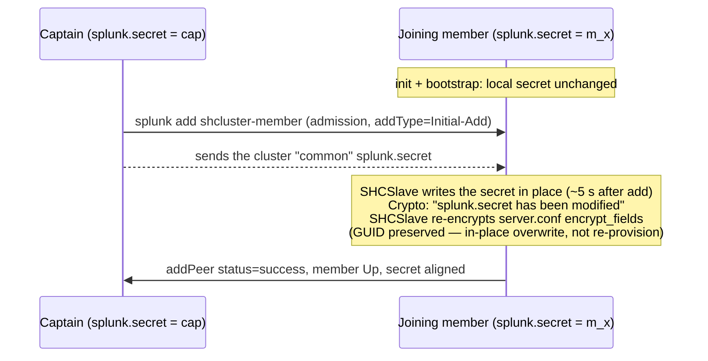

> 🇫🇷 Version française : [../shc-splunk-secret-propagation.md](r_knowledge_base_pro/splunk/splunk/shc-splunk-secret-propagation.md)

# `splunk.secret` in a Search Head Cluster — propagation on member add

Do you really need to **manually copy `splunk.secret` to every member** of a
Search Head Cluster (SHC) before forming it? That's the common belief. This note
shows, with measurements, that on Splunk Enterprise **9.4.6** a joining member's
`splunk.secret` is **overwritten with the captain's the moment you add it to the
cluster** — with no manual step, and without the vendor documenting it.

> Empirical observations on **Splunk Enterprise 9.4.6**, a hand-built 3-member
> SHC, two independent runs. Behaviour may differ on other versions — the
> **instrumentation method** below stays valid to re-check on yours.

---

## 1. Two objects not to confuse

| Object | Role | Must it match across members? |
|---|---|---|
| **`pass4SymmKey`** (`[shclustering]`, set by `--secret` at `init`) | *Security key*: authenticates member-to-member and member-to-deployer traffic | **Yes, explicitly documented.** Entered in clear text, it becomes encrypted at first start and is no longer recoverable from `server.conf`. |
| **`splunk.secret`** (`etc/auth/splunk.secret`) | Key that **encrypts secrets** stored in `.conf` files (passwords, `pass4SymmKey`, app credentials) | **The docs are silent.** This is the subject of this note. |

Hence the confusion: the docs mandate aligning `pass4SymmKey`, and many infer
that `splunk.secret` must be aligned by hand too. Measurement shows the cluster
handles it — at one precise step.

## 2. Instrumentation method (no leak)

Never read the content of `splunk.secret`; capture a **non-reversible
fingerprint**, on each node, at every transition of the build:

```bash
sudo sha256sum "$SPLUNK_HOME/etc/auth/splunk.secret" | cut -c1-16
```

Two identical fingerprints ⇒ identical files. Also correlate the file's
**mtime** (`date -r`) and the instance **GUID** (`etc/instance.cfg`) to tell an
*in-place overwrite* from a node re-identification.

Instrumented steps: **S0** post-install (before any SHC config) → **S1** after
`init shcluster-config` on each member → **S2** after `bootstrap
shcluster-captain` → **S3** before/after each `add shcluster-member` → **S4**
cluster *healthy*.

## 3. What you observe

Fingerprint matrix (symbolic `cap`, `m2`, `m3` = distinct values at start):

| Step | captain | member 2 | member 3 |
|---|---|---|---|
| S0 baseline | `cap` | `m2` | `m3` |
| S1 after `init` ×3 | `cap` | `m2` | `m3` |
| S2 after `bootstrap` | `cap` | `m2` | `m3` |
| before `add` member 2 | `cap` | `m2` | `m3` |
| **after `add` member 2** | `cap` | **`cap`** | `m3` |
| **after `add` member 3** | `cap` | `cap` | **`cap`** |
| S4 healthy | `cap` | `cap` | `cap` |

Key facts, reproduced over two runs and corroborated by the file **mtime** (to
the second):

- `init` and `bootstrap` **do not touch** `splunk.secret`: the three values stay
  distinct as long as no member is added.
- The overwrite happens **exactly at `splunk add shcluster-member`**, **~5 s**
  after admission, identically for each added member.
- The joining member **adopts the captain's fingerprint**. Its **GUID stays
  unchanged**: the `splunk.secret` file is rewritten in place, not a node
  reinstall.
- The surviving value is the **captain's at join time**. A later captain
  re-election does not re-propagate a secret.

## 4. Mechanism — `SHCSlave` (+ `Crypto`) component

The joining member's `splunkd.log`, right at the second of the switch (the
file's `mtime`), reveals the causal sequence — an **intentional onboarding
re-encryption**, not a generic replication side effect:

```text
SHCSlave - Checking for re-encryption of all the fields in encrypt_fields in
           server.conf with new common Search Head Clustering Splunk.secret from
           the captain
Crypto   - splunk.secret has been modified since last read. Re-reading secret.
SHCSlave - Succesfully finished re-encrypting with Search Head Cluster common
           splunk.secret
...      - event=addPeer status=success addType=Initial-Add captain=https://<captain>:8089
```

Reading: on admission the member receives the cluster's **common**
`splunk.secret` from the captain, writes it in place (hence `Crypto:
splunk.secret has been modified`), then **re-encrypts the `encrypt_fields` of
`server.conf`** with that new secret, so its own local secrets stay readable
after the key swap. The phrase "*common … from the captain*" confirms a
**product-intentional** behaviour, driven by the `SHCSlave` role. Same sequence,
independently reproduced on each added member.



## 5. Why it makes sense (and why the docs skip it)

A member receives the captain's *replicated configuration bundle*. If that bundle
carries credentials **encrypted with the captain's `splunk.secret`**, the member
can only decrypt them if it holds **the same** `splunk.secret`. Aligning the
secret at onboarding solves this at the root. The behaviour is consistent with
SHC replication architecture — but the Splunk docs describe only bundle
replication and the `pass4SymmKey` requirement, **not** the propagation of the
`splunk.secret` file. Hence the gap between the belief ("copy it by hand") and
the measured reality.

## 6. Practical implications

- For a **standard SHC onboarding** (fresh member added via `add
  shcluster-member`), pre-copying `splunk.secret` is **not required**: the join
  aligns it. The opposite belief is an oversized precaution for this case.
- The precaution **still matters off this path**: the **deployer's**
  `splunk.secret` must match so that app credentials pushed via `apply
  shcluster-bundle` are decryptable by members — the deployer is not a member and
  is not covered by this onboarding mechanism.
- **Do not rely on this behaviour without checking it on your version**: it is
  undocumented, hence not contractual. Use the method below.

## 7. Re-check on your version

1. Build a throwaway SHC (3 members, **fresh** installs → distinct secrets at
   start; verify at S0 that both fingerprints AND GUIDs differ).
2. Capture the `sha256 | cut` fingerprint on each node at every S0→S4 step.
3. After each `add shcluster-member`, **poll** the member's fingerprint every 2 s
   to measure the adoption latency.
4. Correlate with the file `mtime` and the `splunkd.log` component at the switch.

## Sources

- [Set a security key for the search head cluster — Splunk Docs 9.4](https://help.splunk.com/en/splunk-enterprise/administer/distributed-search/9.4/configure-search-head-clustering/set-a-security-key-for-the-search-head-cluster) — identical `pass4SymmKey` required; unrecoverable after start.
- [Configuration updates that the cluster replicates — Splunk Docs 9.4.1](https://docs.splunk.com/Documentation/Splunk/9.4.1/DistSearch/HowconfrepoworksinSHC) — member downloads the captain's replicated config bundle at join; silent on `splunk.secret`.
- [Add a cluster member — Splunk Docs 9.4](https://help.splunk.com/en/splunk-enterprise/administer/distributed-search/9.4/manage-search-head-clustering/add-a-cluster-member).
